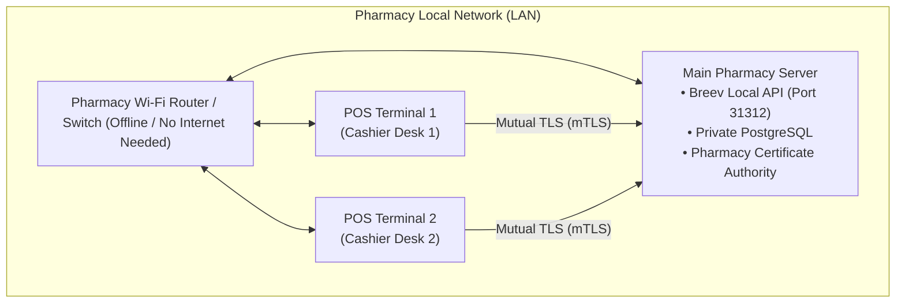

# Breev — Client Installation & Local Network Setup Guide

This guide provides step-by-step instructions for deploying Breev across a local pharmacy network, installing the **Main Pharmacy Server**, setting up **POS Cashier Terminals**, and pairing them securely over the local LAN.

---

## 📋 Overview & Requirements

* **Installer Package:** One offline installer file (`BreevSetup.exe`).
* **Network Requirement:** All devices must be connected to the **same local network** (via Wi-Fi or an Ethernet switch/router).
* **Internet Requirement:** **None.** Breev operates 100% offline.
* **Roles:**
  * **Main Pharmacy Server & Station:** The primary computer holding the central database and local API service.
  * **Additional POS Terminal:** Cashier / sales counters that connect to the Main Server over mutual TLS (mTLS).



---

## ⚙️ Step 0: Recommended Network Preparation (Main PC)

To prevent the local router from changing the Main PC's IP address when restarted, configure a **Static Local IP** on the Main computer:

1. On the **Main PC**, open **Windows Settings** (`Win + I`) → **Network & internet** → **Wi-Fi** (or **Ethernet**).
2. Click on your connected network → scroll down to **IP assignment** and click **Edit**.
3. Change from *Automatic (DHCP)* to **Manual** → toggle **IPv4** ON.
4. Enter the details:
   * **IP address:** e.g., `192.168.1.200` (or `10.50.217.192` depending on your subnet).
   * **Subnet prefix length:** `24` (equivalent to Subnet Mask `255.255.255.0`).
   * **Gateway:** Your router IP (e.g., `192.168.1.1`).
   * **Preferred DNS:** `192.168.1.1` (or `1.1.1.1`).
5. Ensure your Windows Network Profile is set to **Private network** (Settings → Network & internet → set profile type to *Private*).

---

## 🖥️ Step 1: Install the Main Pharmacy Server (Primary Computer)

1. Launch `BreevSetup.exe` on the Primary PC.
2. In the **Device Role** screen, select:
   * 🔘 **Main Pharmacy Server & Station (Primary Computer)** *(Default)*
3. Click **Install**.
4. The installer will automatically:
   * Install and start the private PostgreSQL database service (`BreevPostgreSQL`).
   * Install and configure the local API service (`BreevLocalApi`).
   * Generate the local Pharmacy Certificate Authority (CA).
   * Detect the active LAN IP and create the Windows Firewall rule on port `31312`.
5. Once complete, launch Breev, log in, and complete initial setup.

---

## 💻 Step 2: Install Additional POS Terminals (Cashier Stations)

1. Copy `BreevSetup.exe` to each cashier computer.
2. Launch `BreevSetup.exe`.
3. In the **Device Role** screen, select:
   * 🔘 **Additional POS Terminal (Cashier / Sales Counter)**
4. Click **Install**.
   > **Note:** Terminal installation finishes in seconds because terminals do not install local databases or background services.
5. Launch Breev on the POS Terminal. It will open directly to the **Pairing Screen**.

---

## 🔗 Step 3: Connect & Pair POS Terminal to Main Server

To establish an encrypted, authenticated connection between the POS Terminal and the Main Server:

### 1. On the Main Server:
1. Log in to Breev with an administrator or authorized account.
2. Navigate to **Settings → Devices & Terminals → Pair New Device**.
3. Click **Start Pairing**.
4. A secure 5-minute pairing screen will appear showing:
   * **Pairing QR Code**
   * **Server IP & Port** (e.g., `192.168.1.200:31312`)
   * **Fingerprint Confirmation Phrase**

### 2. On the POS Terminal:
The terminal will present three ways to locate the Main Server:

* **Method A (Automatic Discovery — Recommended):**
  * The terminal scans the LAN using mDNS (`_breev._tcp`).
  * Your pharmacy's Main Server will appear in the candidate list. Click **Connect**.
* **Method B (2D Barcode / Scanner):**
  * Use a 2D barcode scanner connected to the POS to scan the QR code displayed on the Main screen.
* **Method C (Manual IP Entry):**
  * If mDNS is restricted on the router, enter the Main PC's IP and port manually (e.g. `192.168.1.200:31312`).

### 3. Verify & Authorize:
1. Both screens will display a **Fingerprint Verification Phrase** (e.g. `River - Mountain - Falcon`).
2. Verify that the phrase on the Terminal matches the Main Server screen.
3. Click **Approve Pairing** on the Main Server.
4. The Main CA issues an encrypted client certificate to the POS Terminal.
5. The Terminal immediately commits the configuration and opens the POS Checkout interface.

---

## 🛠️ Troubleshooting & Maintenance

### Issue 1: Main Server IP changed (e.g., router reboot without static IP)
* **Symptom:** Cashier terminals show *"Cannot reach Main Server"* or `ECONNREFUSED`.
* **Fix (Takes 30 seconds):**
  1. On the **Main PC**, run the installer and click **Repair** (or run `BreevSetup.exe /repair`).
  2. The repair script re-scans the new IP, updates the Windows service parameters, and updates the Windows Firewall.
  3. *No pharmacy data or database records are modified.*
  4. On the POS terminals, reconnect or scan the new pairing QR code.

### Issue 2: Terminal cannot find Main Server via Auto-Discovery
* **Check 1:** Ensure both computers are connected to the exact same Wi-Fi SSID or switch.
* **Check 2:** On the Main PC, verify the network connection is set to **Private** (Windows blocks mDNS discovery on "Public" profiles).
* **Check 3:** Use **Manual Entry** on the terminal to type the Main PC's IP address directly.

### Issue 3: Windows Firewall Blocking Port 31312
* Verify the rule exists on the Main PC by opening PowerShell as Administrator and running:
  ```powershell
  Get-NetFirewallRule -Group 'Breev'
  ```
  If missing, running `BreevSetup.exe /repair` restores the firewall rules automatically.

---

## 📞 Support & Verification Checklist

- [ ] Main PC is configured with a Static IP or DHCP Reservation.
- [ ] Main PC network profile is set to **Private Network**.
- [ ] `BreevPostgreSQL` and `BreevLocalApi` services are **Running** in Windows Services (`services.msc`).
- [ ] All Cashier Terminals are paired and displaying the active sales screen.
- [ ] Test a sample transaction on the POS Terminal to verify live database sync to Main.
