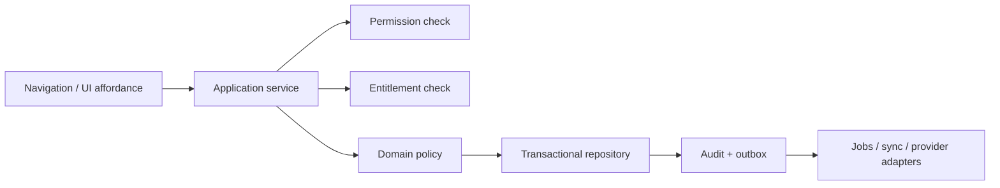

# Proposed Module and Dependency Map

Status: **Phase 0 proposal — not approved for implementation**.

## Dependency direction

```text
deployable apps
  -> application adapters / composition
    -> domain modules
      -> focused shared packages
        -> shared-kernel (minimal primitives only)
```

No domain module may import a deployable app. Domain-to-domain calls should use explicit application contracts/events rather than database-table access. Shared packages must not become a miscellaneous dumping ground.

## Deployable applications

| App | Responsibility | Must not own |
|---|---|---|
| `apps/desktop` | Electron main/preload, React shell, local API client, printing/scanner/update adapters | Domain rules, DB access from renderer, cloud credentials |
| `apps/local-api` | Pharmacy-local NestJS composition root, transactions, LAN endpoints, local jobs | Cloud subscription administration, UI state |
| `apps/cloud-api` | Tenant-isolated cloud API, subscriptions, permitted sync/cloud views | Direct LAN/device assumptions, renderer behavior |
| `apps/super-admin` | Minimal Breev operations UI for plans, tenants, licenses, services | Pharmacy operational editing unless an audited support capability is explicitly approved |
| `apps/migration-tools` | Versioned import/export, schema/data repair and migration commands | Runtime business workflows |

The scaffold has no separate browser client for additional POS terminals. Phase 1 must decide whether the desktop web bundle is served in a browser/LAN mode or a distinct app package is required; this is a packaging choice, not permission to duplicate domain logic. The proposed Payments and future Tax Compliance boundaries also have no current marker packages; ADR-021 does not authorize adding or implementing them in Phase 1.

ADR-023 keeps peripheral access inside narrow trusted desktop/main-process adapters. Printer, scanner, and cash-drawer failures report physical outcomes without owning or replaying the Sales, Cash Box, Inventory, or Accounting command. The versioned Certified Hardware Profile is release/support evidence, not a domain entity and not a promise that every nominally ESC/POS or HID device works.

## Domain modules

| Module | Owns | Publishes/consumes | Explicit boundary |
|---|---|---|---|
| Identity | tenants, pharmacy users, roles, sessions, terminal pairing/key/certificate identities, pharmacy local CA/trust state, device revocation | authenticated actor/device context and revocation state | Does not decide paid plan/seat access; discovery is not trust and device trust never replaces user permission |
| Subscriptions | plans, feature catalog, signed offline licences, trusted time, grace/free-core fallback, service accounts, expiry/audit state | entitlement grants/revocations/reconciliation | Does not grant user permissions or block pharmacy-owned core data access |
| Catalog | products, structured naming components/templates/versions, Arabic aliases, IDs/SKUs/registrations/barcodes, packaging definitions, categories | product snapshots/changes | Generated name is not identity; does not own on-hand quantity |
| Purchasing | suppliers, purchase drafts/invoices/returns, reviewed OCR handoff | purchase-posted/reversed events | Does not mutate stock or journal tables directly |
| Inventory | batches, stock movements, allocation, counts, reorder facts | inventory-changed/cost facts | Does not own purchase document lifecycle |
| Sales | sales drafts/invoices/returns, payments intent, price/discount authorization | sale-posted/reversed events | Does not implement journal posting or patient clinical logic |
| Payments | provider/merchant adapter references, idempotent Payment Attempts, unknown-outcome queries, settlements, provider refunds, chargebacks, callbacks, and reconciliation | confirmed/unknown/settled/refunded/disputed payment facts | Pharmacy owns funds/account; never owns invoice, stock, Cash Box, journal, card secrets, payment licence, or provider-specific authority |
| Accounting | chart, journals, posting templates, receivables/payables, cash boxes | balanced posting results | Does not let reports invent accounting entries |
| Patients | optional Patient Profile/health facts, optional transaction links, necessary-purpose references, consent events, verified destinations, representative authority, CRM facts | consent and patient-linked events | Required posted identity stays in transaction/debt/dispensing owner; consent never grants access; no clinic/doctor workflow |
| Clinical Knowledge | approved source licences/metadata, Clinical Data Bundles, Iraqi-product mappings, deterministic evaluations, freshness, evaluation snapshots, and kill-switch state | advisory clinical results and content-health state | Does not diagnose, prescribe, determine dosage, own regulatory stock blocks, or treat missing evaluation as safety; pharmacist validation is mandatory |
| Privacy Governance | retention-policy versions/start events, deletion requests/outcomes, scoped legal holds, minimal Deletion Ledger, patient-export authorization, support grants/reviews | disposal eligibility/outcome, restore-block, support-access state | Orchestrates domain-owned end actions; cannot rewrite posted facts or let Breev Support overrule the pharmacy |
| Messaging | pharmacy WhatsApp identity references, versioned templates/approval states, consent/provider/jurisdiction checks, privacy-minimized content, tenant-attributed usage, queue/cancellation, delivery attempts, and replaceable official provider adapters | delivery, cost attribution, and confirmed cancellation/deletion status | Pharmacy owns account/number/content; no shared sender, direct commerce authority, hidden overage, in-memory timers, or bypass of medicine/health release gates |
| OCR | provider/model/region approvals and benchmarks, source hashes, extraction jobs, field locations/confidence, provenance snapshots, provider deletion outcomes, page usage/cost, and reviewed draft handoff | reviewed OCR draft plus confirmed provider/deletion/usage outcome | Never owns/post purchases, products, stock, prices, payments, or journals; patient-data work needs ADR-016 gates and manual purchasing always remains available |
| Synchronization | outbox/inbox, checkpoints, command IDs/statuses/idempotency, field ownership/version conflicts, device/cloud replication policy | idempotent integration envelopes and locally acknowledged commands | Does not directly mutate module tables or resolve conflicts without module policy/authorized human |
| Integrations (future/entitled) | versioned Outbound Integration Contracts, minimum field mappings, connector credentials, durable outbound jobs, authenticated status callbacks, provider deletion outcomes | external delivery/status evidence | No free outbound automation, arbitrary fields, direct local record mutation, or bypass of patient/consent/provider/jurisdiction/entitlement gates |
| Tax Compliance (future) | jurisdiction/spec versions, taxpayer credential references, submission jobs/statuses, Tax Submission Snapshots, and authority correction links | accepted/rejected/pending tax-submission facts | Does not define tax law, own invoices/journals, rewrite posted facts, or treat a local PDF/QR as official acceptance |

## Focused shared packages

| Package | Intended seam |
|---|---|
| `shared-kernel` | IDs, time/result primitives, actor/tenant context contracts; keep small |
| `contracts` | versioned API/integration DTO contracts, not domain entities |
| `money` | currency amount, precision and rounding policy once ADR-006 is approved |
| `units` | exact integer quantities and packaging conversion types |
| `permissions` | permission vocabulary/evaluator interface |
| `entitlements` | capability vocabulary/evaluator interface |
| `audit` | append-only audit envelope and actor/device metadata |
| `sync-protocol` | transport envelope, idempotency/checkpoint types |
| `validation` | boundary schemas and normalized error format |
| `i18n` | locale/direction/message contracts |
| `ui` | theme tokens and reusable presentational components only |
| `testing` | fixtures, contract tests, and test infrastructure |
| `database-local` / `database-cloud` | Drizzle connection/migration adapters; schemas remain owned by modules |

## Cross-cutting enforcement path



Permission, entitlement, audit, and idempotency checks must survive calls that bypass the visible UI. Navigation hiding alone is not enforcement.

## Cloud operational boundary

Cloud infrastructure is a deployable operating concern, not a domain module and not an authority over local posted pharmacy facts. ADR-022 provisionally requires a versioned Cloud Data Location Matrix, managed multi-zone PostgreSQL, encrypted protected recovery copies, restore quarantine, privacy-safe monitoring, and timed incident response. No vendor, region, support plan, or production purchase is selected in Phase 0; these choices are reviewed in Phase 2 and revalidated immediately before Phase 9 deployment. A cloud or control-plane outage may degrade paid cloud capabilities but cannot stop the Main Pharmacy Computer's Free Core POS or LAN.

## Future-package quarantine

Clinic is excluded. Multi-branch, delivery, e-commerce, marketing automation, inter-pharmacy need exchange, supplier comparison/auto-order, biometric payroll, broad API/Zapier/Telegram, multi-currency, external payments, and e-invoicing remain outside the initial core implementation until their ADR-021 provider/jurisdiction release gates are satisfied and the package is explicitly promoted.
