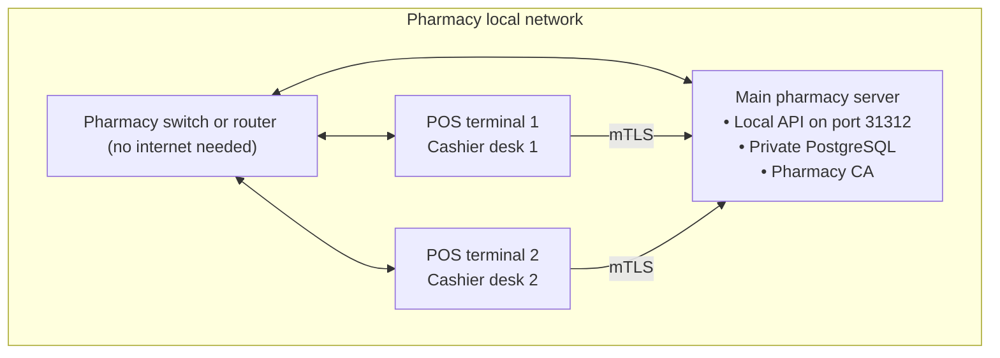

# Breev client installation and local network setup

This guide walks through deploying Breev in a pharmacy. You will configure the main server, install cashier terminals, and pair them across the local network.

---

## Requirements

- Installer package: `BreevSetup.exe`
- Local network: all machines connected to the same switch or Wi-Fi router
- Internet connection: none (Breev runs completely offline)

---

## Roles

Breev assigns each computer one of two roles:

- **Main Pharmacy Server & Station:** The central machine in the pharmacy. It hosts the PostgreSQL database, runs the `BreevLocalApi` service, manages the local certificate authority, and serves as an active cashier station.
- **Additional POS Terminal:** A cashier computer. Terminals run the desktop app and connect to the main server over mutual TLS (mTLS). They do not store a local database.



---

## 0. Set a static local IP on the main computer

Routers hand out dynamic IP addresses that change whenever the router reboots or power drops. When the main computer gets a new IP, every cashier terminal loses connection. Fix this before installing:

1. Open Windows Settings (`Win + I`), then go to **Network & internet** > **Wi-Fi** (or **Ethernet**).
2. Select your connected network, find **IP assignment**, and click **Edit**.
3. Change the setting from **Automatic (DHCP)** to **Manual**, and turn on **IPv4**.
4. Enter your network settings:
   - **IP address:** Pick an unused address on your subnet, such as `192.168.1.200`.
   - **Subnet prefix length:** `24` (equivalent to subnet mask `255.255.255.0`).
   - **Gateway:** Your router IP, usually `192.168.1.1`.
   - **Preferred DNS:** Your router IP or `1.1.1.1`.
5. Check your network profile type under **Network & internet**. It must be set to **Private network**. Windows blocks local discovery on public networks.

---

## 1. Install the main server

Run `BreevSetup.exe` on the primary computer:

1. On the **Device Role** screen, select **Main Pharmacy Server & Station (Primary Computer)**.
2. Click **Install**.
3. The installer sets up the environment:
   - Installs and starts the `BreevPostgreSQL` service.
   - Installs and starts the `BreevLocalApi` background service.
   - Generates the local pharmacy Certificate Authority (CA) for device pairing.
   - Detects the active LAN IP and adds a Windows Firewall rule for port `31312`.
4. When installation finishes, open Breev, sign in, and complete the initial pharmacy setup.

---

## 2. Install cashier terminals

Run `BreevSetup.exe` on each counter computer:

1. On the **Device Role** screen, select **Additional POS Terminal (Cashier / Sales Counter)**.
2. Click **Install**. This takes only a few seconds because terminals do not run PostgreSQL or local background services.
3. Open Breev. It starts on the pairing screen, waiting for an invitation from the main server.

---

## 3. Pair terminals to the main server

Terminals authenticate with the main server using mutual TLS. Both machines must be on the same local network.

### Start pairing on the main server

1. Sign in to Breev with an administrator account.
2. Go to **Settings** > **Devices & Terminals** > **Pair New Device**.
3. Click **Start Pairing**. The screen displays a QR code, the server IP and port (such as `192.168.1.200:31312`), and a confirmation phrase. The pairing window stays open for 5 minutes.

### Connect from the terminal

Choose the easiest method on the terminal screen:

- **Automatic discovery (fastest):** The terminal scans the network via mDNS (`_breev._tcp`). When your pharmacy server appears in the list, click **Connect**.
- **Barcode scanner:** If you have a 2D barcode scanner plugged into the terminal, scan the QR code from the main server screen.
- **Manual IP:** If your router blocks mDNS broadcasts, type the main server IP and port directly.

### Confirm and approve

1. Look at the confirmation phrase on both screens (for example, `River - Mountain - Falcon`).
2. Make sure both phrases match.
3. Click **Approve Pairing** on the main server.
4. The main server issues a client certificate to the terminal. The terminal saves it, connects to the local API, and opens the checkout screen.

---

## Troubleshooting

### Terminals cannot reach the main server after a reboot

If the main computer was not assigned a static IP, the router probably gave it a new address.

Run the installer on the main computer and click **Repair** (or run `BreevSetup.exe /repair` from PowerShell). The repair tool detects the new IP, updates the local service configuration, and refreshes the firewall rule. It never touches your database or pharmacy records.

Once repair completes, reconnect or re-pair the terminals.

### The terminal cannot find the main server automatically

1. Confirm both machines are on the same subnet and Wi-Fi network. If the cashier is connected to a guest network, the router will isolate it from the main machine.
2. Confirm the main computer's network profile is **Private**. Windows disables mDNS on public profiles.
3. If auto-discovery still fails, enter the main server IP address and port manually.

### Windows Firewall blocks port 31312

Check whether the rule exists from an administrator PowerShell prompt:

```powershell
Get-NetFirewallRule -Group 'Breev'
```

If the rule is missing, run `BreevSetup.exe /repair` to recreate it.

### Verifying Windows services on the main computer

Open Windows Services (`services.msc`) and verify both services are running:

- `BreevPostgreSQL`
- `BreevLocalApi`

If either service is stopped, right-click and select **Start**.

---

## Quick setup checklist

- [ ] Main computer has a static IP address or DHCP reservation.
- [ ] Main computer network profile is set to **Private**.
- [ ] Both `BreevPostgreSQL` and `BreevLocalApi` services are running.
- [ ] Windows Firewall allows port `31312`.
- [ ] Cashier terminals are paired and show the checkout screen.
- [ ] A test sale on a cashier counter records immediately on the main server.
