# Breev project brief

This brief records the complete requirements, business rules, notes, ambiguities, examples, phase boundaries, pricing and package assumptions, and implementation constraints. It leaves conflicting requirements open for clarification.

Terminology used here includes **drug wholesaler/distributor** (*madhkhar*), **batch/lot** (*wajba/batch*), and **supplier allowance/discount** (*samah*). Supporting screenshots remain the authority for visual details that the surrounding description does not capture.

---

# Page 1

## Requirements

### Breev technical requirements for Phase 1, MVP

The user interface and navigation menu must be fully dynamic based on the features enabled for each pharmacy (**feature toggling**).

For example, optional modules such as **Messaging/SMS Notifications** must be enabled or disabled from the **Super Admin** panel. If a module is disabled for a particular pharmacy, its navigation tab and every related function must be completely hidden for that pharmacy.

Online synchronization, cheapest-supplier comparison, and stock-needs requests must also be optional. The software is intended to be offered to pharmacies free of charge for a limited period under a standard package, after which subscriptions will depend on the selected package and the features unlocked by that package.

The architecture must ensure that **two-way synchronization and cloud-side editing in Phase 2** can be turned on or off per pharmacy from the **Super Admin Dashboard**. The source associates this with the **Gold plan**.

**Packaging rule.** Avoid fractional quantities in the packaging system.

The system must be flexible enough to offer **one-way synchronization** for basic plans and enable **two-way synchronization** selectively for particular pharmacies or chains. The source also lists **"Platinum plan - one-way"**, which may conflict with the other plan wording and requires clarification.

### Phase 1 MVP requirements and deferred work

The following **must be included in Phase 1**:

1. **OCR & AI Matching**
   Automatically scan paper invoices using OCR and intelligently match invoice items against the system catalog using AI. This capability should be selectable for specific pharmacies and tied to the AI layer for invoice filtering and intelligent matching.

2. **Patient CRM & Messaging Engine**
   Full patient profiles, refill/dose scheduling, automated patient communication, and remote export of audit records to spreadsheets. A weight-based encouragement-message feature is also requested. Subscription features will be divided into packages.

3. **Multi-Terminal In-Store Setup**
   A local network supporting **3 POS terminals + 1 data-entry device**, all operating concurrently. A second POS terminal should only be unlocked through a subscription.

4. **Past Sales Invoice Editing & RBAC**
   Ability to edit completed sales invoices under strict permission control: blocked for employees and enabled for administrators.
   **Status in source:** under study; programmer consultation is required.

5. **Multi-Language & Inventory Indicators**
   Arabic/English interface switch, notifications icon, dark/light mode toggle, and dynamic color coding for states such as expired stock, low stock, sale below cost, items without barcodes, and refrigerated items.

---

# Page 2

## Requirements

6. **Multi-Criteria Filtering**
   Comprehensive filtering in reports and tables by name, date, profit margin, category, and other criteria appropriate to each column.

7. **Excel-style table for named-patient sales invoices only**
   A table interface for sales invoices associated with patients whose names were recorded. The source distinguishes this from an external API integration and mentions mapping columns to Google Sheets.

### Deferred to Phase 2 or later

- External web-based Admin Dashboard.
- Multi-branch and multi-currency architecture.
- Integration with drug wholesalers/distributors for automatic supplier-price comparison and AI-assisted auto-ordering.
- Biometric/fingerprint hardware integration and automated payroll.
- Requesting needed stock from other pharmacies.
- External-integration interface, distinct from the table mentioned above.
- Delivery interface.
- Store/e-commerce integration.
- Promotion and marketing.

The price for Phase 2 has been discussed with the programmer and presented preliminarily. It will be discussed and negotiated again in Phase 2 based on the programmer's demonstrated capabilities after Phase 1 is completed.

**Note.** In the Lovable prototype, the item-detail panel on the left side is important in both the sales and purchasing interfaces. Its importance is referenced repeatedly for those interfaces.

### Global architecture and authentication

**Authentication gate.** Access must strictly require a username and password; direct bypass must be disabled.

In the online version, an owner may see more than one pharmacy if they own multiple branches.

**Currency display.** The primary currency is standardized as **"Dinar" (I.D.)**. The source also mentions credit/card payment, Visa, and secondary currencies.

For cash handling, the system must distinguish between the actual cash drawer and a card/credit account based on how the customer pays. An icon should allow the register to switch to the card/credit account so the physical cash balance remains accurate.

From the sales interface, the user selects whether payment is card/credit or cash. The cash drawer in Iraqi dinar is the default/main option.

Credit sales may be allowed for some known patients.

---

# Page 3

## Requirements

## Section 1: Main dashboard and system overview

### 1. Embedded Breev AI engine

**Primary function.** An interactive AI assistant embedded in the system with broad system-level context awareness.

**Internal capabilities:**

- Real-time queries about inventory levels, item availability, and medicine location.
- In Phase 1, availability refers to inventory inside the system. In Phase 2, after wholesaler/distributor integration, the assistant should also determine whether an item is available from a distributor, compare post-discount prices, and suggest the most suitable supplier.
- Patient status, including whether treatment appears continuous or interrupted; clinical history such as chronic medications and conditions; monitoring medicines dispensed under the patient's name; reminders for birthdays and treatment due/refill dates.
- Operational analytics, sales insights, and predictive forecasting for stock-outs or excess inventory.

**External connectivity and response boundaries:**

The architecture should be ready to connect to external messaging APIs so the AI can automatically answer customer/patient inquiries coming from Meta channels and WhatsApp.

A strict permission boundary is required. Administrative controls must define exactly what the AI may answer outside the internal system. For example, it may be limited to stock-availability questions while financial data, confidential cost information, and some answers involving psychotropic/mentally affecting medicines remain hidden.

### 2. Business intelligence and data grids

**Real-time metric overview.** Interactive summary cards for key business indicators such as sales, low-stock alerts, expiry warnings, and patient follow-ups.

**Data-grid architecture.** Fully interactive grids supporting fast multi-column sorting, direct filtering, and custom grouping according to the interface model, with export capabilities for scheduled reports and operational auditing.

For Phase 1, the AI role may be limited to basic tasks such as entering a purchase invoice.

The page then shows a proposed model for the main dashboard.

---

# Page 4

## Page assets
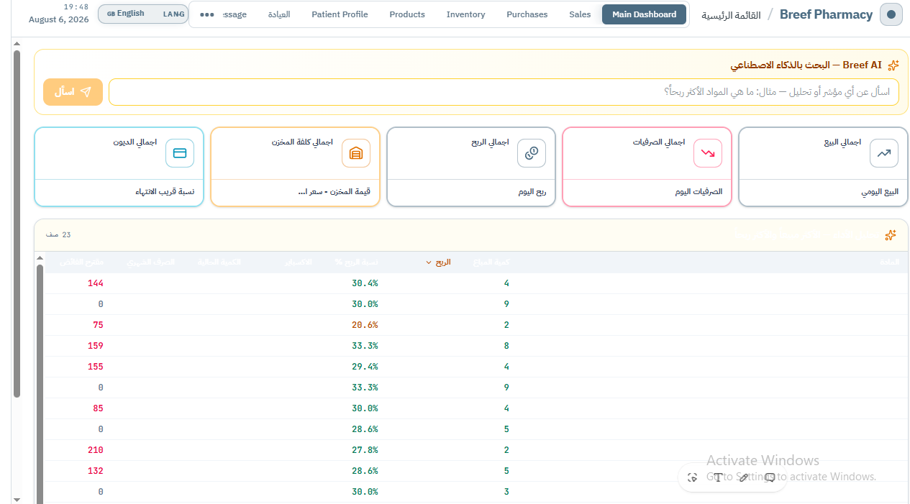

## Requirements

The lower dashboard columns represent:

- Item name
- Quantity sold
- Profit generated
- Profit percentage
- Expiry
- Quantity in stock
- Monthly dispensing/consumption rate
- Suggested excess stock

All columns must be sortable ascending or descending.

Add an **item-alert icon** for item-related notifications such as expiry, excess stock, and negative/short stock conditions.

Add a **patient-alert icon** for patient-related notifications such as message reminders, appointment reminders, birthday reminders, approaching treatment/refill dates, and stock checks.

Add an icon at the top for **invoice and due-payment alerts**.

The three alert categories may be combined into one icon near the language selector, with three tabs inside it.

## Section 2: Point of sale and sales interface

---

# Page 5

## Page assets
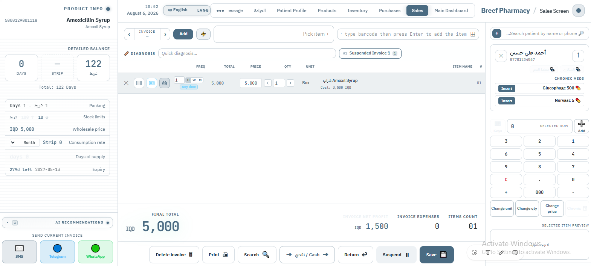

## Requirements

### 1. Patient CRM and predictive sales panel

**Smart patient search.** An auto-suggestion drop-down appears as soon as the user starts typing a patient's name.

**Chronic-condition/history drawer.** Selecting a patient dynamically shows the patient's chronic conditions, long-term medications, and relevant clinical concerns.

**Direct add to cart.** Chronic medications can be selected and added directly to the active sales invoice with one click.

**Automatic clinical-note pop-up.** When a patient is selected, a dedicated pop-up displays notes from the patient's profile, such as smoker status, allergies/sensitivities, or alcohol use. The pop-up can be dismissed to continue the sale and payment process.

**Quick patient registration.** A prominent **+** button beside the patient-search field opens a fast pop-up for immediately creating a new patient record.

### 2. Fast operations and custom items

**Quick service fee / miscellaneous item (`+ Add`).** Placed directly above the numeric calculator. It opens a quick-entry item such as a professional service or virtual item with a default cost of zero, allowing the value to be treated as 100% gross profit and entered/saved immediately.

**Quick-key grid (lightning icon).** Toggles a customizable quick-access grid for fast-moving items or items sold frequently without barcodes, such as individual strips/capsules. Quick-access items are configured from Settings and may be grouped into folders within this panel.

---

# Page 6

## Page assets
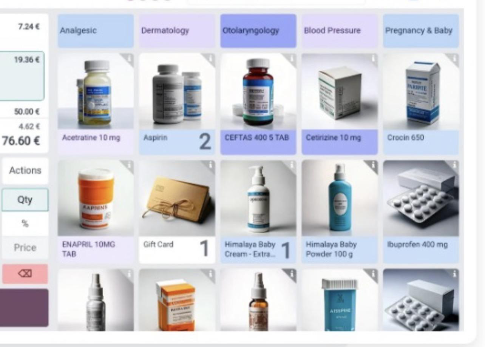

## Requirements

### 3. Smart keypad and item editing

**Interactive on-screen keypad.** Supports manual numeric input together with quick action keys for adjusting quantity, price, and discount, including a control described in the source as "remove the unit." The keypad can be hidden from Settings.

**Direct line-item editing.** Clicking a price cell directly inside the invoice grid opens a quick numeric keypad / pop-up calculator for immediate editing of that line.

**Dynamic product-image preview.** Shows a thumbnail of the active item directly below the calculator area.

**Current-session cash box.** Shows the current open cash-box value beneath the product image.

An icon above the calculator, labeled in the source as **keys**, should switch to **chronic** mode. After selecting or registering a patient and placing one or more medicines on the sales invoice, pressing this icon should copy those medicines into a chronic prescription/treatment list in the patient's profile. The user can then either complete the sale or cancel the invoice.

### 4. Shortcuts and invoice management

**Item-definition window (`+ Add`).** Opens a floating card for creating or editing product records without closing the active sales screen. It should also open automatically when a scanned barcode is not found in the system or when a typed item name is not found and the user presses **Enter**.

---

# Page 7

## Requirements

The item pop-up should contain the item's main fields, including:

- Item name
- Barcode
- Cost price
- Selling price
- Special price
- Packaging
- Expiry

Packaging prices should be converted automatically between the small and large unit as intended by the configured packaging ratio.

**Previous-invoice search (search icon).** Opens a pop-up list of completed/saved invoices, allowing the user to open and inspect them.

**Editing behavior.** Direct editing is not available in the sales interfaces; sales returns should be used instead.

Provide arrows to move to the previous and next invoice.

**Left-side panel.** Shows detailed information about the active item. Some fields can be configured from Settings. Information includes the item name, scientific/generic name, current availability, packaging, maximum and minimum stock levels, batch/lot data, expiry shown both numerically and as remaining days, and suggested excess stock.

### 5. Embedded clinical AI and invoice dispatch

**Real-time clinical AI assistant.** An embedded smart indicator that can provide dosing guidance and drug-interaction alerts step by step during the transaction.

**One-click invoice sending (`Send`).** Immediately sends a digital copy of the invoice to the communication channel stored in the patient's profile.

### Additional technical notes

- Double-clicking any item line in a saved/displayed invoice must open the **Item Master Card**. The invoice should be temporarily suspended while the user previews or updates general product details such as barcode, packaging units, or price, without losing unsaved data from the current invoice.

- **Flexible cash-register management with no forced shift lockouts.** Instead of a rigid open-shift/close-shift model that blocks the POS screen, the system should use a continuously available cash drawer/register model. Cash reconciliation, settlements, and cash receipt/expense entries must be available at any time without blocking active sales transactions.

6. Add a field for the **number of doses/uses**, defaulting to per day, with alternatives for per week or per month.

The **before food / after food / unaffected by food** rule is configured from the Item Master Card.

7. Link the treatment date and treatment type to the **third unit (number of days)** so the system can schedule a message or alert before that patient's treatment supply runs out. Ignore this logic when the sale is not associated with a named patient.

8. Add a **matching icon**. When clicked, it opens a pop-up proposing **10 items** for matching. Items that have been matched disappear; unmatched items remain. Each day, the system proposes 10 different items.

**Note.** If the same item appears more than once on the invoice, highlight it with a specific color.

---

# Page 8

## Page assets

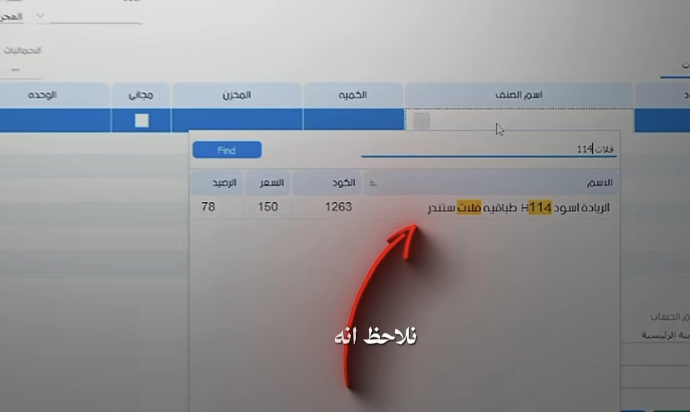

## Requirements

- Support optional columns that can be shown or hidden. Example: a **Free Product** checkbox. If a patient is buying multiple items and one item is intended to be free, selecting this field subtracts that item's price from the invoice so that item is sold at zero price.

- Add **4 additional configurable fields** in the sales-interface settings. They can be named, hidden/shown, and customized.

- Smart search must work across sales, purchasing, and the system generally, even when the search terms appear separated by another word inside the stored name.

- Columns should be inserted/reordered using **drag and drop**.

---

# Page 9

## Page assets
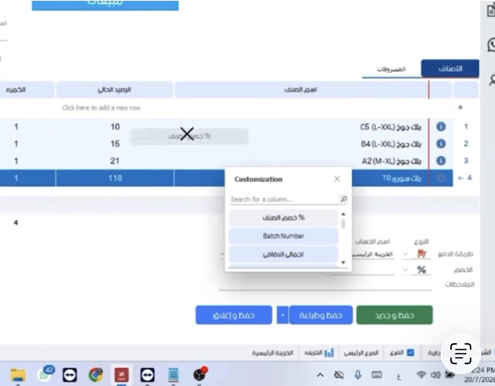

## Requirements

### Phase 2, after the system is upgraded to two-way synchronization

### 1. Invoice data integrity and snapshots

When a sales invoice is saved, the system must store a **frozen snapshot** of all item details inside that invoice, including name, barcode, purchase price, selling price, batch/lot, and expiry date. Later changes to the product's Item Master Card must **never retroactively alter historical invoice data**.

### 2. Optional left data panel

**Monthly consumption rate:**

Current requirement: calculate the average monthly consumption over **1, 2, or 3 months** for each specific trade name/brand.

---

# Page 10

## Page assets
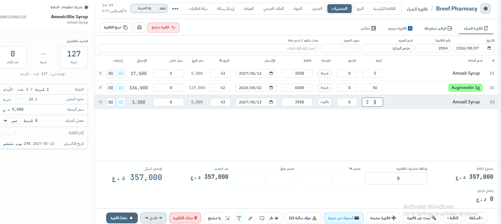

## Requirements

**Future expansion.** The architecture should also support aggregating monthly consumption by **scientific/generic name (active ingredient)** across equivalent brands that share the same molecule.

**Usability note.** Actions and workflows should require as few clicks as possible. Data entered on each interface must remain intact if the user navigates to another interface and then returns.

Add a **dose-calculation field** for each medicine on the sales interface. The user enters patient weight and age, and the system determines the dose.

Sales-interface information such as profit, cash-box value, and cost price should be hideable from system settings.

## Section 3: Purchases and supplier management

### 1. Keyboard navigation grid

**Fast data-entry flow.** The first column is the item name or barcode field and supports instant search and rapid barcode scanning.

Pressing **Enter** moves the cursor automatically through the active fields in sequence. The source text for the exact field sequence is partially corrupted in the PDF text layer, but the intended flow clearly includes the item, quantity, cost/purchase price, and selling price fields.

Columns may be moved up/down or arranged as needed.

The behavior of **Enter** can be configured to return directly to the barcode-entry field.

**Automatic row creation.** Pressing Enter in the last active field automatically creates a new row in the table, or immediately returns focus to the barcode/item search field for continuous rapid entry. This behavior is selected from Settings.

### 2. Retail pricing

---

# Page 11

## Requirements

Selling price and special price should be calculated dynamically at packaging level using one of two approaches:

1. A preconfigured target profit-margin percentage stored on the Item Master Card.
2. The item's default selling price stored on the Item Master Card, updated according to the most recently saved purchase invoice. The selling price may be edited from the purchase invoice when the item is priced by a fixed price rather than by a percentage.

Depending on the mode selected on the Item Master Card, the system should either lock both the price and percentage from editing or lock only the percentage.

### 3. Supplier profile and dual-cost accounting

**Supplier profile tab.** Dedicated tab for managing distributor/supplier records, standard terms, and linked discount/allowance percentages.

**Automatic discount engine.** Automatically retrieves the selected supplier's default discount percentage and applies it to the gross purchase total.

**Dual-cost transparency:**

- **Price before discount / base unit cost:** Treated as the official base item cost in inventory. The source states that Settings may allow the pharmacy owner to choose a costing method such as direct cost, average cost, or last purchase cost.
- The pharmacy owner therefore chooses which cost basis the system uses. The source indicates that **average cost based on the pre-discount cost** is the default display for inventory and other interfaces.
- **Price after discount / net cost:** Used as an additional value for accurate ledger/financial reporting and payment settlement, alongside the primary pre-discount cost.

Both cost values must be shown explicitly on purchase invoices and supplier statements.

**Supplier statement columns should include:**

1. System sequence number
2. Date, searchable and sortable
3. Supplier invoice number, searchable
4. Supplier name, searchable and sortable
5. Invoice amount before discount, optionally hideable
6. Invoice amount after discount, optionally hideable
7. Return amount before discount and return amount after discount, both optionally hideable. The source notes that the post-discount return value may be hidden by default.
8. Transaction type (purchase, payment, or other) with notes, searchable, sortable, and hideable
9. Running balance before discount
10. Running balance after discount
11. Totals at the end of the row/table

The statement should support reconciliation/matching and allow a field or date to be highlighted with a distinctive color.

### 4. Past purchase invoices and side panel

**Past-purchase search.** Opens a floating window showing previous purchase invoices with full viewing and tracking capabilities.

---

# Page 12

## Page assets
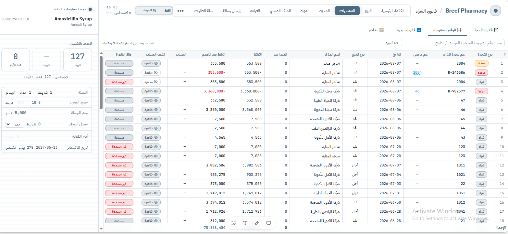

## Requirements

### Purchase-invoice adjustments

The **Delete Invoice** option should be unavailable by default, although it may be exposed from Settings. When enabled, the interface should warn: **"We do not recommend deleting saved invoices."**

The statement should provide actions for:

- Return entire invoice
- Return selected items
- Correct an error

When a saved invoice needs adjustment after a meaningful period of time:

1. **Return the invoice:** The original invoice is copied with the full amount/stock effect reversed to negative, creating a complete return invoice with the same supplier name and supplier invoice number but a new system sequence. A control may hide both the original and reversing documents from the supplier statement display if desired.

2. **Correct only the error:** A correction can be made only for the erroneous quantity, price, invoice number, or supplier name, with a required reason note. Suggested reasons:
   - Quantity error
   - Price error
   - Invoice-number error
   - Supplier-name error
   - Other, with a reason supplied by the user

When **Edit Invoice** is selected, the system creates an **adjustment draft linked exclusively to the original invoice**. The user sees a complete editable copy of the original details. The original invoice is never edited or deleted.

On save, the system automatically compares the edited copy to the original and extracts **only the differences (Delta)**. Unchanged items are ignored. The differences are recorded as a **Purchase Invoice Adjustment** document linked to the original invoice number. Only the difference affects inventory movement and the supplier account according to the type of change.

The original invoice record must list all linked adjustments, including adjustment number, date/time, user, reason, and difference in amount/quantity. The user must be able to navigate from an adjustment to the original invoice and from the original invoice to its adjustments.

An adjustment must **not** be treated as a new purchase invoice, and the full invoice quantity must never be counted a second time.

---

# Page 13

## Requirements

The system must support multiple adjustments to the same invoice when necessary, assigning a serial identifier to each one, for example **#10025-A01, #10025-A02**. Accidental duplicate adjustments must be prevented through a **Draft** mechanism, a warning when an unfinished adjustment already exists, and a difference summary before final save with explicit user confirmation.

The original invoice must remain immutable after approval, and the system must keep a full audit trail for every adjustment.

**Important.** A **purchase return** is a separate business operation from an **invoice adjustment**. A return represents goods physically leaving the pharmacy and going back to the supplier. An invoice adjustment represents correction of data from a previous invoice.

3. **Item return:** Create a purchase-return invoice.

### 5. AI purchase-invoice OCR

**Import from image.** Capture paper purchase invoices and use AI vision/OCR to extract item lines, barcodes when available, quantities, expiry dates, batch/lot numbers, and cost prices automatically.

**Smart catalog matching.** AI automatically links extracted line text or barcodes to the closest matching item record in the system database.

### 6. Sequential fuzzy search

**Real-time sequential character matching.** The search field dynamically filters records as characters are entered, across both the sales and purchasing screens.

Additional notes:

- Double-clicking an item line in a saved/displayed invoice opens that item's Item Master Card for quick review or general product-detail updates.
- Invoice search should display a pop-up in an Excel-like table containing saved-invoice details. Double-clicking an invoice opens it immediately.
- Return invoices appear in the supplier statement together with other invoices based on the document date. Settings may enable/disable hiding fully reversed invoices.
- Opening a return invoice should show the purchase-invoice number and date and allow navigation to the purchase invoice; likewise, the purchase invoice should link back to its return invoice.
- The left-side panel should show active-item details, batch history, and current inventory status, like the sales interface.
- Printed return invoices, purchase invoices, and quotation invoices should be customizable with multiple layouts/colors.
- Reconciliation should be available from the last reconciliation point.
- Profit margin is defined as a percentage/margin **on the selling price, not the purchase price**.

## Section 4: Inventory and quick stock audit

---

# Page 14

## Page assets
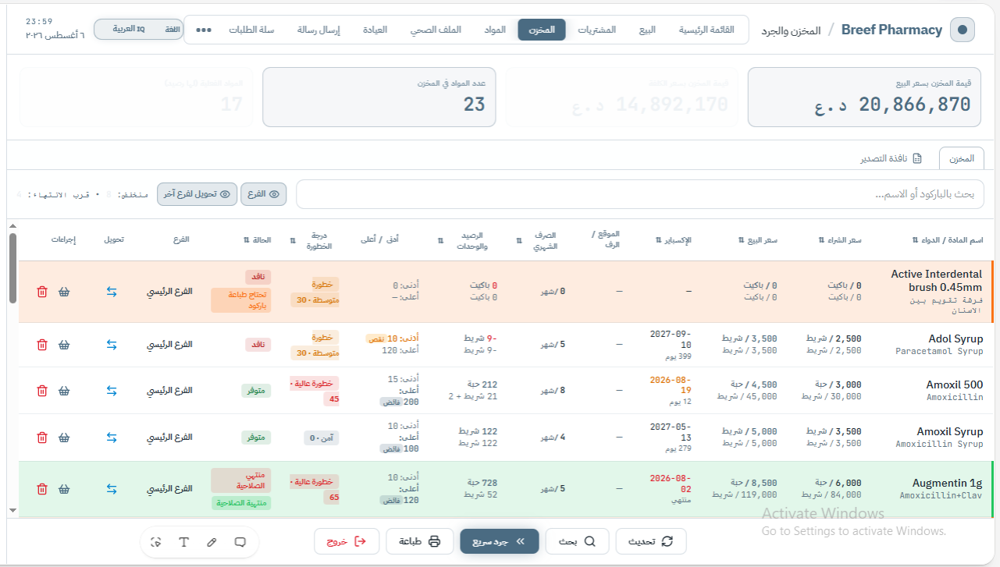

## Requirements

- Allow the **Branch Name** column to be shown or hidden, and allow switching between branches.
- All other columns should be sortable ascending or descending.
- Remove the item-delete icon.

### 1. Read-only inventory grid and reorder basket

**Read-only data access.** Inventory balances, historical values, and basic item details are shown read-only to prevent accidental manual changes during routine work.

**Add to reorder basket.** Every item row includes a dedicated action/field for adding the item directly to the reorder basket.

### 2. Quick stock-audit correction

**Fast keyboard flow.** The active cursor automatically focuses the **Scan Barcode** field. Pressing Enter moves directly to **New Balance**. Saving/confirming returns focus to the barcode field for the next item.

---

# Page 15

## Page assets
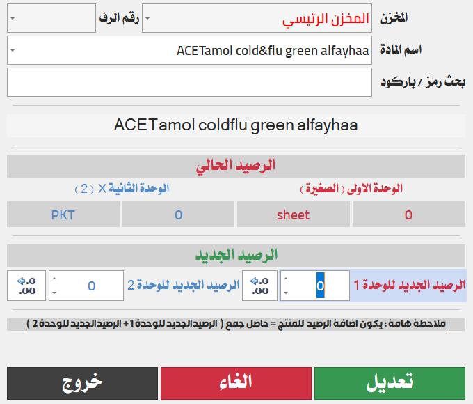

## Requirements

The calculator can be shown by clicking the **000** box.

**Audit-grid columns and multi-unit ratio logic.** The grid shows barcode, item name, current system balance, new balance in the large unit, and new balance in the sub-unit. Conversion may work forward or in reverse. Entering a new quantity dynamically recalculates the actual total stock based on the packaging ratio.

**Example.** If the pictured medicine physically consists of **2 packs and 1 strip**, the user may either enter the equivalent as **5 strips in the base unit**, or enter **2 packs + 1 strip**.

### 3. Owner-only inventory export

A confidential inventory-export interface containing complete, unmasked inventory metrics, valuation figures, and supplier purchase records. It is highly confidential, password-protected, and restricted to the owner.

### 4. Custom layout and optional columns

Provide additional grid space/optional columns for:

- Maximum stock level
- Minimum reorder point
- Monthly consumption rate
- Risk indicator
- Detailed expiry information

---

# Page 16

## Page assets
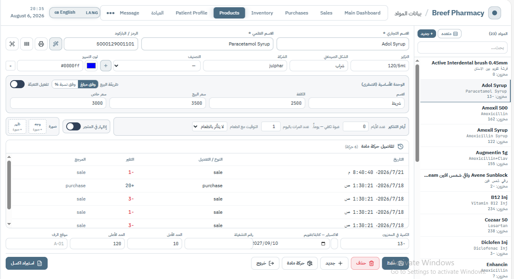

## Requirements

Add an icon for **initial stocktaking / opening inventory count**.

## Section 5: Item Master Card and item definition

### 1. Layout and visual settings

The item has a color indicator/square controlled by settings.

There should be both:

- Fixed colors chosen manually by the pharmacy/user
- Automatic colors selected by the system

Examples:

- An item received from a wholesaler without a barcode may be given a specific manually selected color so that, if it is ordered again, the user is reminded to print a barcode.
- If an item is sold below purchase cost, the system should apply the configured **below-cost-sale** color.

### 2. Two item modes

The Item Master Card should support two dynamic modes, switched using a double-arrow toggle between **Type A** and **Type B** labeling.

**A. Pharmaceutical mode: drugs**

Fields are strictly English-language and include:

- Trade name
- Scientific/generic name
- Strength/concentration
- Dosage form
- Manufacturer
- Category
- Barcode

**B. General materials and medical devices**

A specialized interface for medical supplies and cosmetics. The primary English title is built dynamically by combining defined fields.

---

# Page 17

## Requirements

The general-material mode also includes an **indexed Arabic search name directly below the English title**.

The title composition shown in the source is:

`[company/manufacturer] + [sub-brand/series] + [type/use] + [property/degree] + [target/audience] + [size/volume]`

### 3. Multi-unit packaging and pricing

**Item-level selling-price strategy.** A control selects whether package pricing follows a **fixed package price** model or a **profit-margin percentage** model.

The default unit shown in sales/purchasing can be configured as either the large or small unit; the large unit is the default in the source.

The default may also be configured separately per interface. Example: large unit is default for purchasing and small unit is default for sales.

**Secondary unit / package.** Inventory balances are converted dynamically using the packaging ratio when sold. The source requests automatic upward rounding to the nearest **250-500 Iraqi dinars (IQD)** as applicable when converting pricing between small and large units.

**Tertiary unit, number of days.** This unit is evaluated strictly relative to the base unit and is used only for dose scheduling and patient-consumption tracking. It is **not used for purchase or sales transactions**.

### 4. Item movement audit

A real-time audit window must show the complete lifecycle/history of the selected item, including sales invoices, purchase invoices, and inventory corrections. Direct access to the underlying documents is governed by RBAC permissions.

### 5. External-app integration and visibility

- Add a control allowing or blocking web display and data synchronization for external applications, so certain medicines can be prevented from appearing online.
- Configure whether a medicine is taken before food, after food, or unaffected by food.
- The number of times per day should appear by default on the sales interface.
- If selling price is percentage-driven, lock editing of both percentage and price on purchase invoices. If selling price is fixed-price-driven, lock percentage editing only.
- Add an AI-data-sharing permission so availability and price can be shared for AI responses while data about mentally affecting/psychotropic medicines can be blocked from sharing.

Near the barcode field, provide **4 icons**:

1. Suggest a barcode for an item without one.
2. Print barcode.
3. Add multiple barcodes to the same item.
4. The source states that the fourth icon is not needed.

---

# Page 18

## Page assets

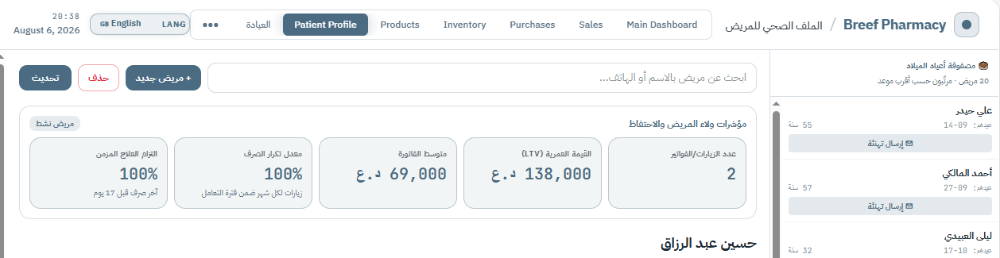

## Requirements

Additional item-card requirements:

- Add a dose-calculation field for each medicine; it appears on the sales interface.
- An item that has historical movements/transactions must **not be deletable**; the system should prevent deletion.
- The movement/history of one item may be transferred/replaced with a new item, after which the old item may be deleted. This should be a dedicated **Replace Item with Another Item** interface in Settings.
- Add a control on the Item Master Card to hide an item from search results on the sales and purchasing interfaces while keeping it searchable from the item-management interface. This supports hiding/freezing an item when the pharmacy does not want to delete it.
- Add a third price that can be shown/hidden from Settings in both sales and item-definition interfaces, called **Official Price**. This is the official selling price set by the Iraqi authorities/Ministry. Some items do not have an official price.
- Add **4 additional configurable fields** to the Item Master Card; they can be named, hidden/shown, and customized.

## Section 6: Patient clinical EMR and analytics

---

# Page 19

## Page assets
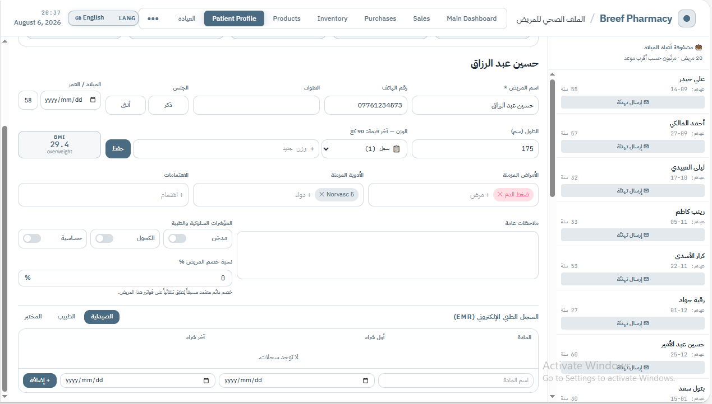

## Requirements

### 1. Weight and BMI tracking

**Weight log.** Supports entering and saving new weight records with a dynamic BMI history.

**AI progress analysis.** Compares weight/BMI trends and drafts clinical follow-up/encouragement messages for the patient. The source identifies weight-based messaging as a paid feature.

A sequence/history view may be added showing patients ordered by the most recent person whose weight was measured.

### 2. Medication purchase history from POS

Build the patient's medication-use profile in real time from historical sales invoices. Include treatment-adherence indicators such as:

- First and most recent sale date for each medicine to that patient
- Total quantity sold during that period
- Based on visit frequency, determine whether the patient appears **continuous/adherent** or **interrupted** for each treatment

### 3. Contraindication and chronic-drug alerts

An active safety indicator evaluates medicines in real time against the patient's recorded chronic conditions and long-term treatments.

### 4. Readiness for lab and e-prescription integration

The data architecture should be prepared in advance to receive laboratory diagnoses/results and physicians' electronic-prescription records.

---

# Page 20

## Page assets
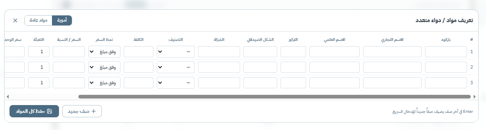

## Requirements

5. Support a **patient-specific discount**. Any sales invoice recorded under that patient's name should automatically receive the configured discount percentage/value.

6. The right-side panel should show patients in birthday order/sequence with the option to send a message. This is a **paid feature** and may be hidden for subscribers who do not have it.

7. Add a **Do Not Disturb** control when a patient asks not to receive messages. Communication should then be restricted to only the most necessary alerts; the source specifically mentions canceling the treatment-expiry/refill reminder.

8. **Birthday greetings and loyalty tracking.** Track dates of birth and support automatic greeting templates and promotional codes.

9. **Multiple-item definition** for faster initial setup/definition of many items at once.

Add **4 configurable fields** to the customer/patient card; they can be shown/hidden and customized.

---

# Page 21

## Page assets
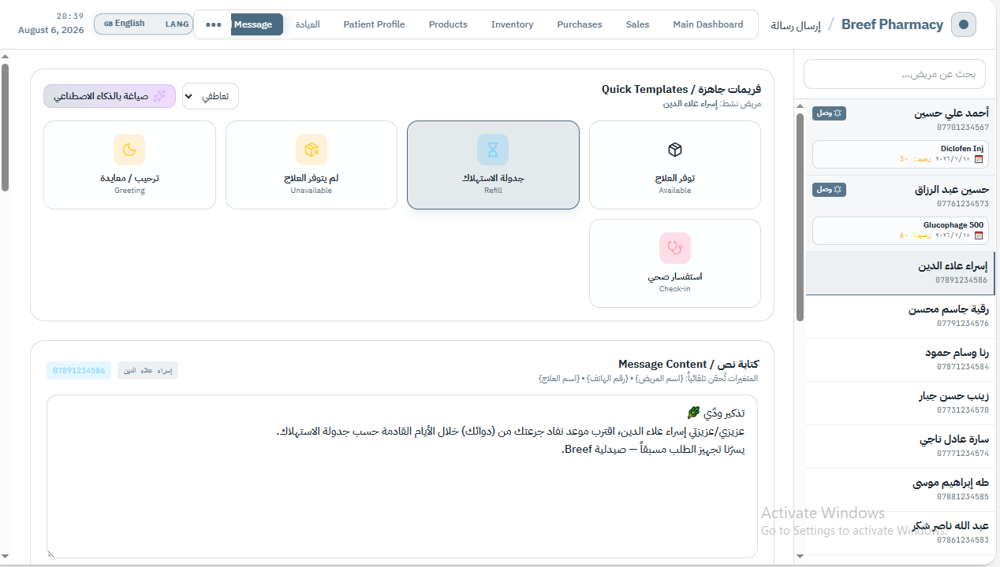

## Requirements

## Section 6.1: Patient engagement and notifications

This is intended as a **fully paid module** that can be divided into two parts.

One part is dedicated to **sending or scheduling messages**.

---

# Page 22

## Page assets
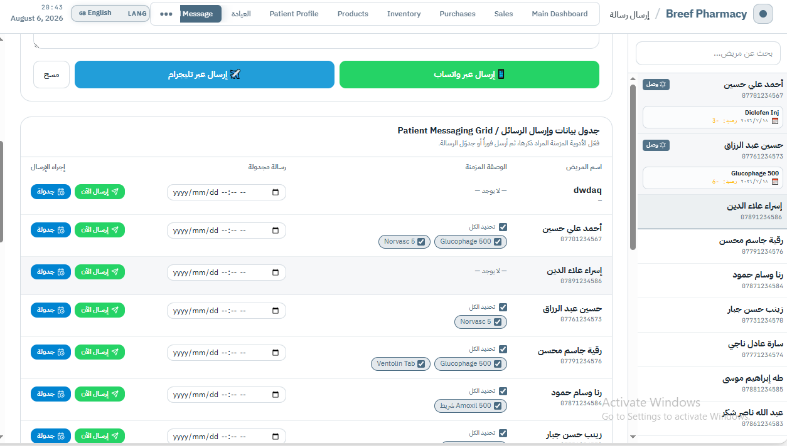

## Requirements

### 1. Full-width grid

Add a left-side strip/list showing the person's name and scheduled communications ordered from nearest to farthest date/time.

The right-side strip is for medication due/refill dates and sending reminders that treatment is about to run out, based on the patient's most recent purchase.

### 2. Direct and scheduled messaging

Allow immediate direct messaging from the patient's EMR profile as well as scheduled delivery at specific times.

Workflow:

1. Select the customer/patient.
2. Select the message template.
3. Choose **Send Now** or **Schedule**.

Add a field for entering a new template type when the desired template does not exist; the newly entered template should then be added to the available templates.

### 3. Item reservation and price-change alerts

---

# Page 23

## Page assets
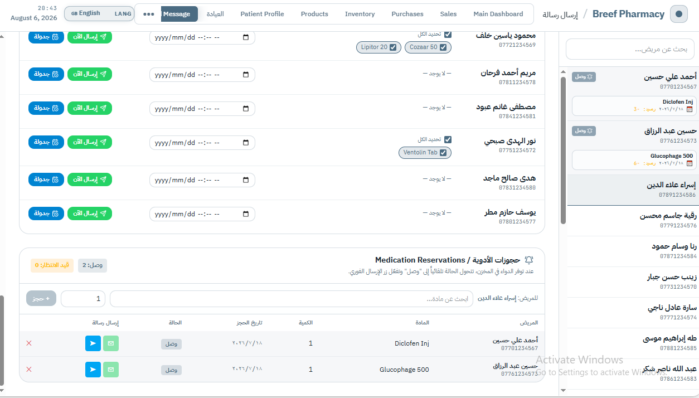

## Requirements

Provide stock-availability alerts and optional notifications when the retail price changes for reserved/backordered items. The price-change alert itself should be enableable/disableable.

Reserved patients/items are ordered in the right-side strip so that reservations for medicines that have become available rise to the top. After a message is sent, the reservation is cleared and the patient leaves the sequence. The same lifecycle applies to the other message categories.

## Section 7: Reorder basket and procurement

---

# Page 24

## Page assets
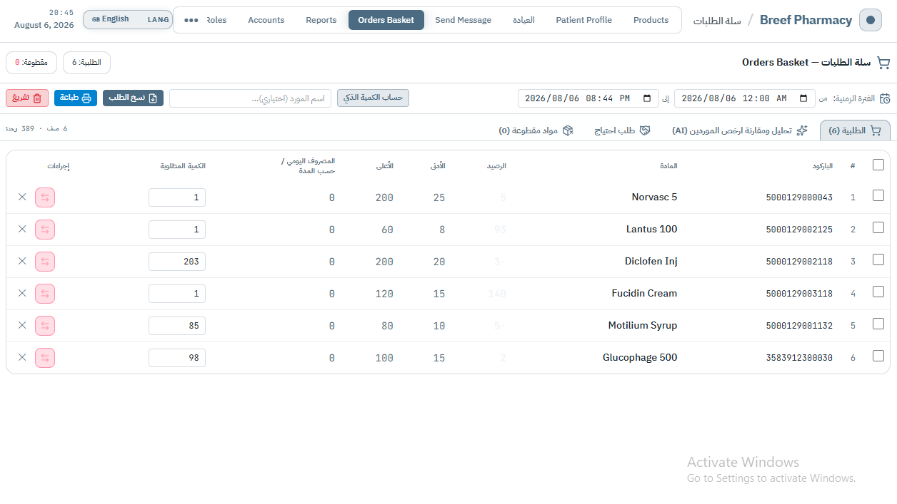

## Requirements

1. When an item is added to the reorder basket, calculate the suggested order quantity automatically as:

**maximum stock level minus current inventory balance**

The proposed quantity is filled automatically but remains editable.

2. **Risk and consumption metrics.** A time-filtered grid should track risk level and ordering or consumption speed. It compares current quantity and dispensing speed with the latest expiry data and uses color to show whether the stock is likely to be consumed before expiry.

3. **Exchange between backordered and discontinued items**

---

# Page 25

## Page assets
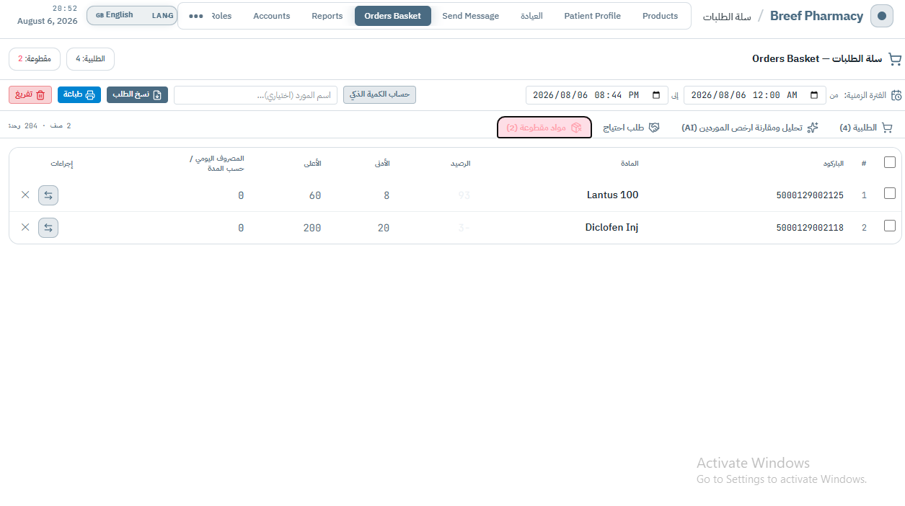

## Requirements

A two-way synchronization layer between the reorder basket and the unavailable/discontinued-items list is not currently available. Add a **Status** column, where an unavailable item may appear in red.

After distributor/wholesaler integration in Phase 2, the system should alert when that item becomes available again so it can be returned to the reorder basket and ordered. Its status should change to **Available** in green or another clear indicator.

4. When an item is ordered from the reorder basket, move it to a new **Requested/Ordered Items** interface that retains the same columns and adds:

- Order status, for example **Ordered** in blue
- Order date
- Return-to-Reorder-Basket action

If the item becomes available, the status changes to **Available** in green. If it remains unavailable, it can be returned to the reorder basket and then, if appropriate, moved to the unavailable-items list.

The source requires bidirectional links between:

- Unavailable-items interface ↔ reorder basket
- Reorder basket ↔ requested/ordered-items interface after ordering, including a return option

5. **Supplier price integration, Phase 2 readiness only.** The data model should support future APIs that compare supplier prices, but API activation is deferred to later phases.

## Section 8: Reports, filtering, and audit

### 1. Custom date and time range

Precise filtering using user-defined start/end values for both date and time.

### 2. User and staff account filters

A dedicated account/username filter available across operational reports.

# Page 26

## Page assets
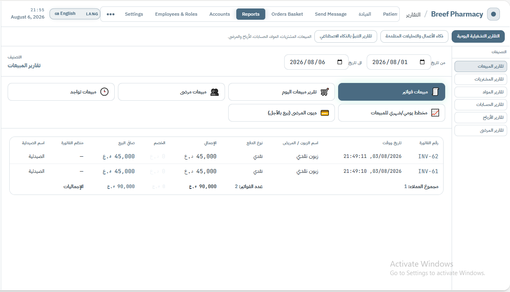
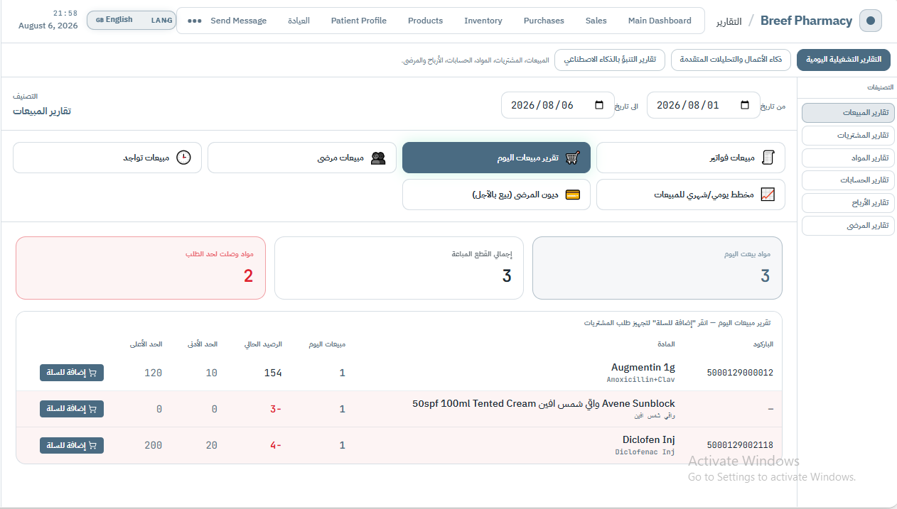

## Requirements

### 3. Audit trails

Show the **Operator ID / account name** alongside exact timestamps and the details of each financial or operational transaction.

### 8.1 Sales reports

The page begins a sequence of proposed sales-report screens. The screenshots show the intended report navigation, date-range filtering, summary cards, and drill-down tables.

---

# Page 27

## Page assets
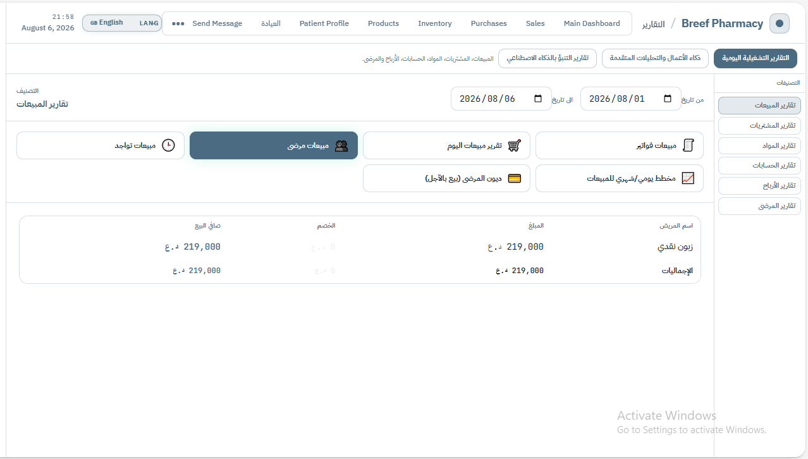
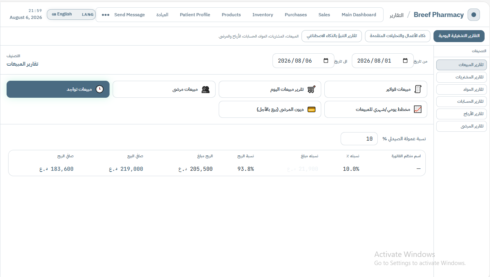

## Requirements and screenshot details

This page is image-driven and contains two example **Sales Reports** screens for the date range **2026/08/01 to 2026/08/06**.

The report area provides report options corresponding to concepts such as:

- Invoice sales
- Today's sales
- Patient sales
- Time-based/hourly sales
- Sales chart/graph
- Patient debt/credit sales

The first screenshot shows a **patient-sales** style report with a patient row and monetary values, including a displayed total/net amount of **219,000 IQD**.

The second screenshot shows another sales analysis view with a configurable discount percentage field, shown as **10%**, and summary values including sales of **219,000 IQD**. Some small labels and row-level values exist only in the screenshot, so it remains the authority for those details.

---

# Page 28

## Page assets
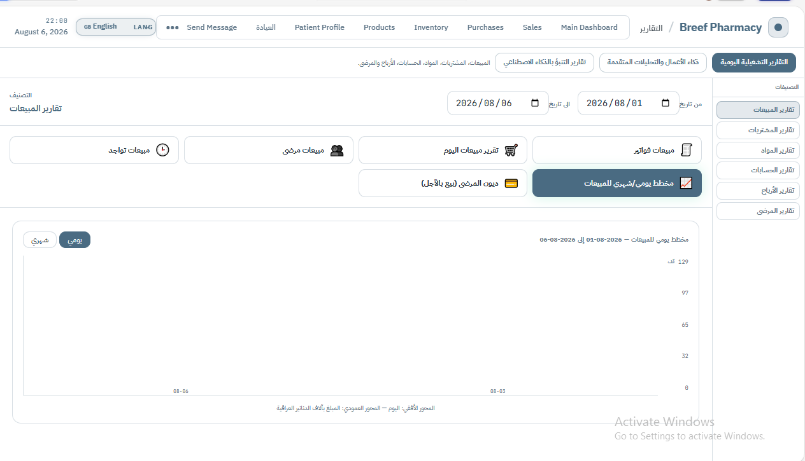
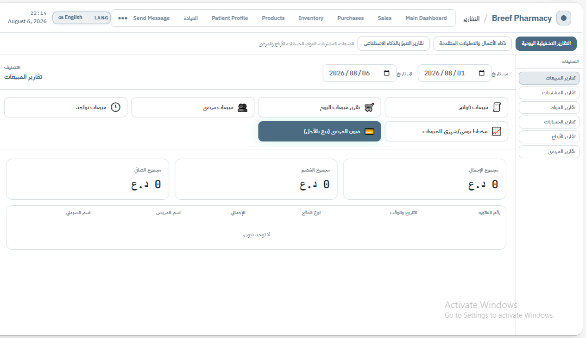

## Requirements

**"Displayed as columns."**

## Screenshot details

The upper screenshot shows the sales graph/report option, with the chart intended to be displayed as a column/bar-style visualization for the selected date range.

The lower screenshot shows a **patient debt / credit-sales** report. Summary cards show total amount, total discount, and total net, and the table contains columns for invoice number, date/time, payment type, total, patient name, and cashier/user. In the pictured state, the summary values are zero and the table reports no debt records.

---

# Page 29

## Page assets
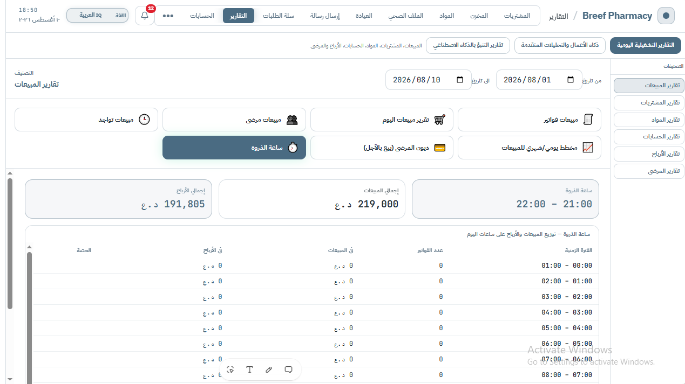

## Requirements

### 8.2 Purchase reports

## Screenshot details

The screenshot immediately above the heading still belongs to the sales-report examples and shows an **hourly sales** analysis. It displays:

- Active-hour range: **21:00-22:00**
- Total sales: **219,000 IQD**
- Total profit: **191,805 IQD**
- Hour-by-hour rows for invoice count, sales, profit, and percentage/share

The next subsection begins the **Purchase Reports** examples.

---

# Page 30

## Page assets
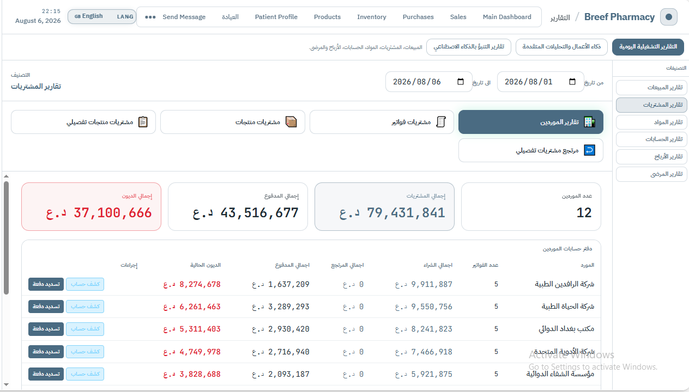
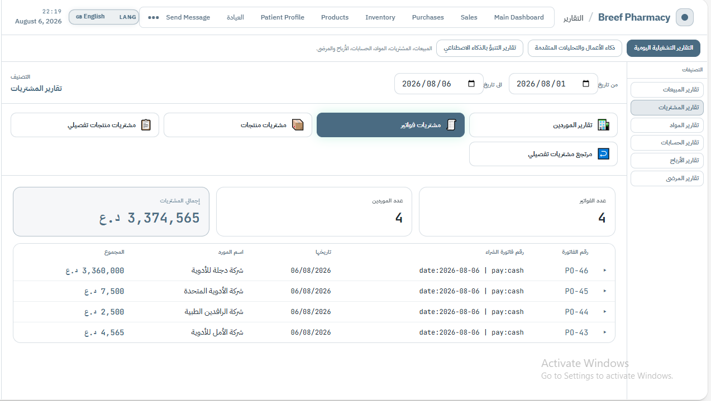

## Requirements and screenshot details

This image-only page shows two **Purchase Reports** examples for **2026/08/01 to 2026/08/06**.

### Supplier and wholesaler report

The upper screenshot is a supplier/wholesaler summary. It includes summary cards such as:

- Number of suppliers: **12**
- Total purchases: **79,431,841 IQD**
- Total paid: **43,516,677 IQD**
- Total supplier debt/outstanding balance: **37,100,666 IQD**

A supplier table lists each supplier with invoice counts, purchase totals, returns, payments/current balance, and actions such as viewing a statement or account details.

### Purchase-invoice report

The lower screenshot shows a purchase-invoice report with:

- Number of invoices: **4**
- Number of suppliers: **4**
- Total purchases: **3,374,565 IQD**

Visible invoice numbers include **PO-46, PO-45, PO-44, and PO-43**, with supplier names, dates, payment method or status, and totals. The screenshot remains authoritative for exact row labels and values.

---

# Page 31

## Page assets
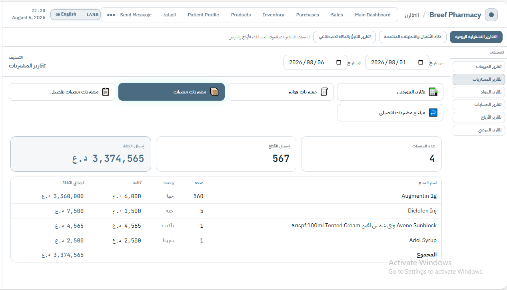

## Requirements and screenshot details

This image-only page shows a **purchases by item/product** report.

Summary cards show:

- Number of products/items: **4**
- Total units/quantity: **567**
- Total cost: **3,374,565 IQD**

The visible rows include items such as:

- **Augmentin 1g**, quantity **560** units, cost **3,360,000 IQD**
- **Diclofen Inj**, quantity **5**, cost **7,500 IQD**
- **Adol Syrup**, quantity **1**, cost **2,500 IQD**
- **Avene Sunblock 50spf 100ml Tinted Cream**, quantity **1**, cost **4,565 IQD**

The page demonstrates reporting by product name, quantity, unit, cost, and total cost.

---

# Page 32

## Page assets
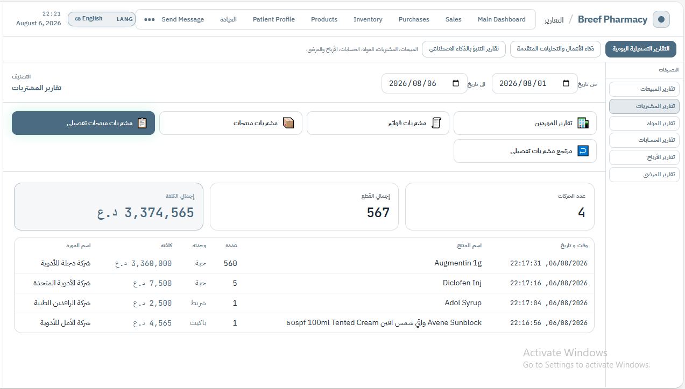
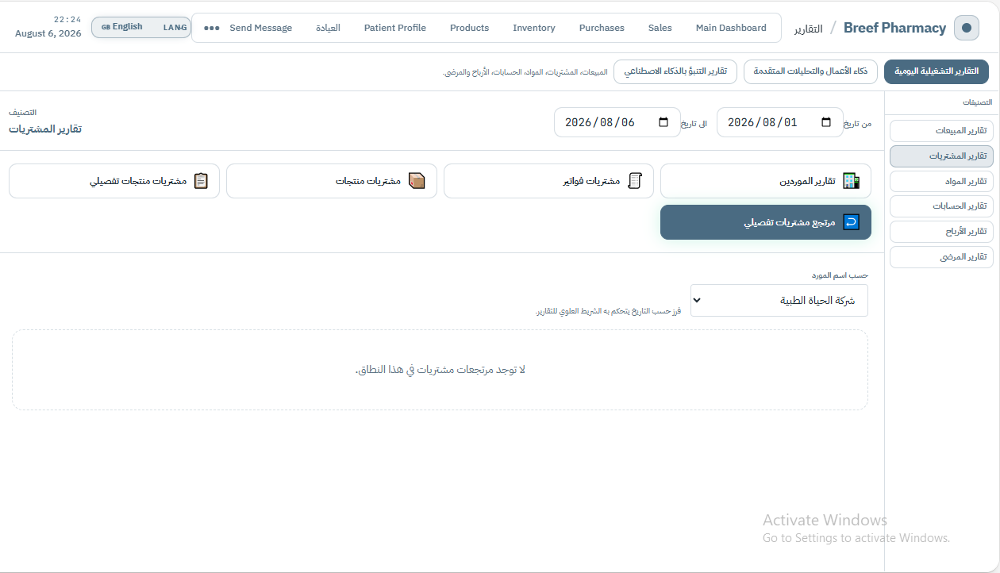

## Requirements

### 8.3 Item and product reports

## Screenshot details

The upper screenshot shows a **detailed purchases-by-product** report, including date/time, product name, quantity, unit, cost, and supplier. It retains the same overall totals shown on the preceding purchase-item report.

The lower screenshot shows a **detailed supplier-return report** selector. A supplier can be chosen from a drop-down; the pictured state indicates that there are **no purchase returns within the selected range**.

The following subsection begins **Item Reports**.

---

# Page 33

## Page assets
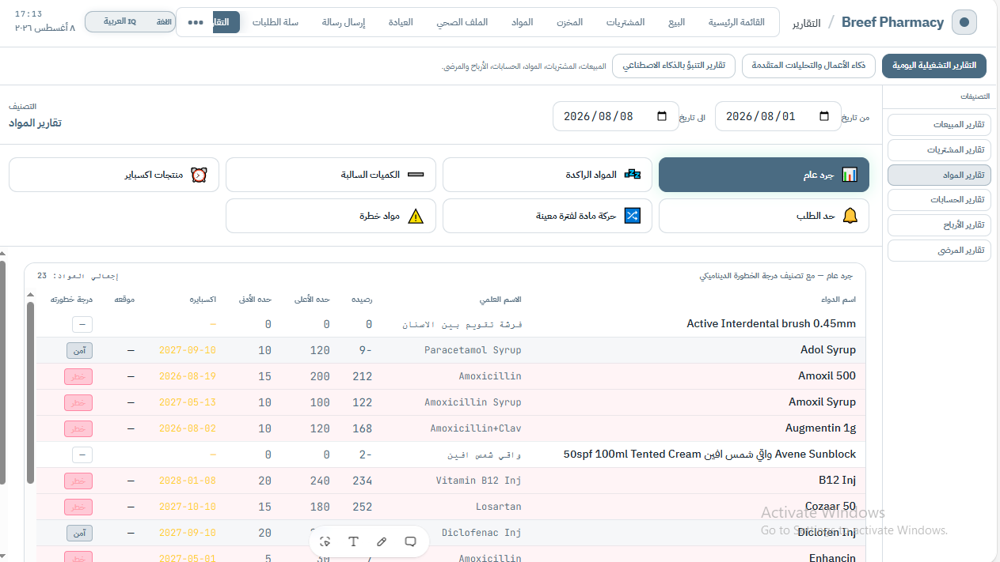
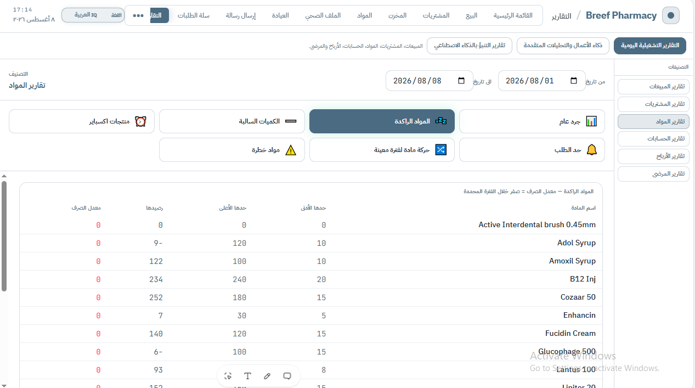

## Requirements and screenshot details

This image-only page demonstrates two **Item Reports**.

### General inventory/item report

The upper screenshot provides tabs for reports such as:

- General inventory
- High-stock items
- Current quantities
- Expired products
- Low/negative stock
- Items below minimum level / reorder threshold
- Items requiring attention or with risk conditions

The table shows item name, scientific/generic name, current balance, maximum level, minimum level, expiry, and related status indicators. Visible examples include **Adol Syrup, Amoxil 500, Amoxil Syrup, Augmentin 1g, B12 Inj, Cozaar 50, Diclofen Inj**, and other products.

### High-stock report

The lower screenshot shows a high-stock/excess-stock style view with columns for item name, minimum level, maximum level, current balance, and movement/consumption rate, making excess inventory visible.

---

# Page 34

## Page assets
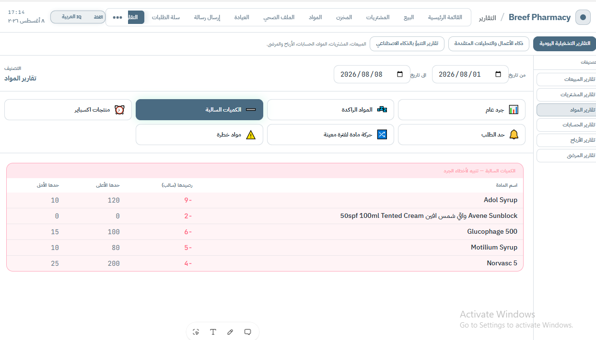
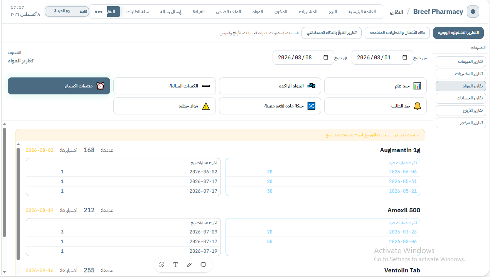

## Requirements and screenshot details

This image-only page demonstrates:

### Low and negative stock report

The upper screenshot highlights low/negative quantities in a warning-colored table. Visible rows include products such as **Adol Syrup, Avene Sunblock, Glucophage 500, Motilium Syrup, and Norvasc 5**, with current balances below configured thresholds.

### Expiry products report

The lower screenshot shows an expiry-focused view. Each product card/section includes current quantity, expiry date, and historical purchase/batch entries with dates and quantities. Visible examples include **Augmentin 1g, Amoxil 500**, and **Ventolin Tab**.

The intent is to provide traceable expiry risk by item and batch/purchase history rather than only a single current expiry value.

---

# Page 35

## Page assets
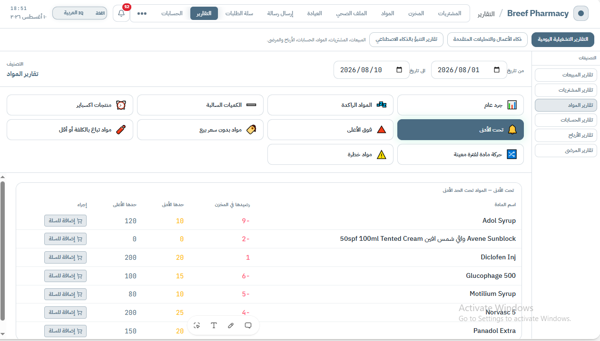
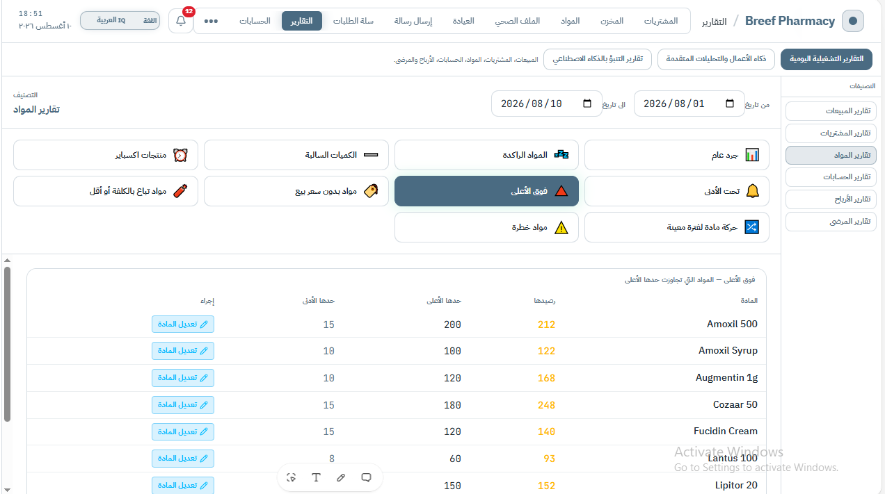

## Requirements and screenshot details

This image-only page shows additional Item Reports.

### Below-minimum and reorder report

The upper screenshot lists items whose balance is below their configured minimum/reorder threshold. Columns show item name, current balance, minimum level, maximum level, and an action to add the item to the reorder basket.

Visible product examples include **Adol Syrup, Avene Sunblock, Diclofen Inj, Glucophage 500, Motilium Syrup, Norvasc 5, and Panadol Extra**.

### Excess-stock report

The lower screenshot lists products whose stock exceeds the configured maximum level and includes an action to edit the Item Master Card. Visible examples include **Amoxil 500, Amoxil Syrup, Augmentin 1g, Cozaar 50, Fucidin Cream, Lantus 100**, and **Lipitor 20**.

---

# Page 36

## Page assets
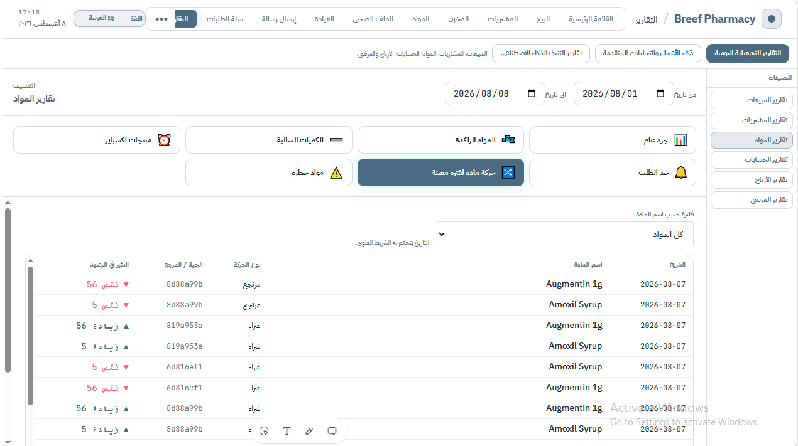

## Requirements and screenshot details

This image-only page shows an **item movement/history report**.

A product filter can be set to **All Items**. The table records:

- Date
- Item name
- Movement type (for example, purchase or return)
- Reference/document identifier
- Quantity impact on balance

The visible examples include repeated movements for **Augmentin 1g** and **Amoxil Syrup** on **2026-08-07**, with positive/negative balance changes. The purpose is to make stock movement traceable to the originating transaction/reference.

---

# Page 37

## Page assets
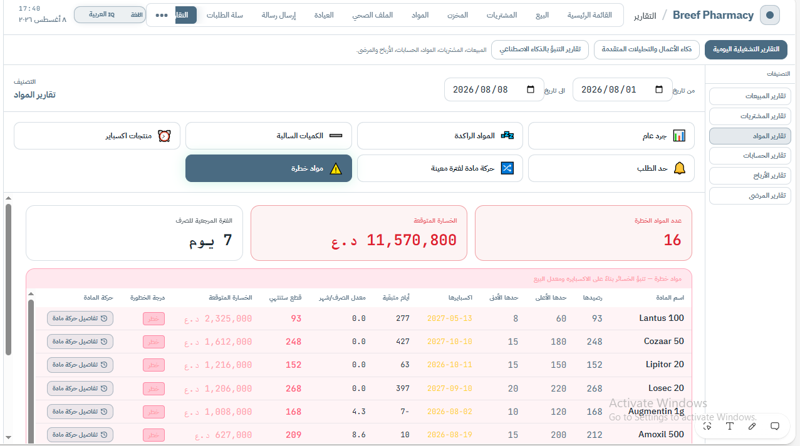
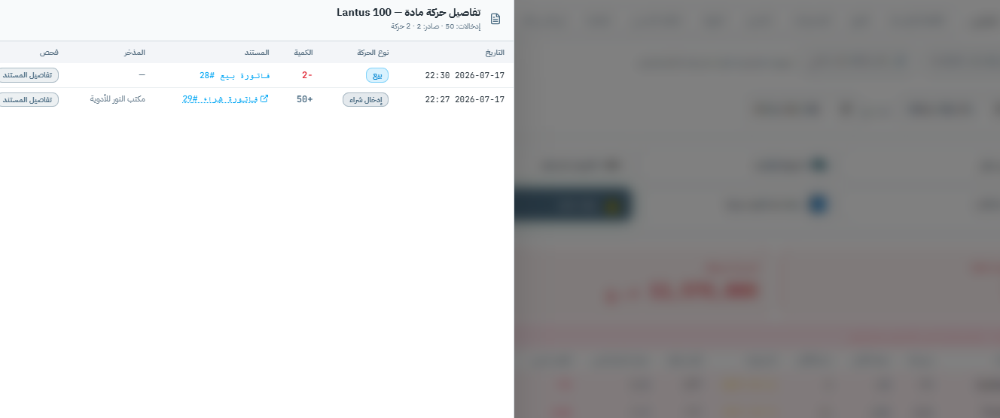

## Requirements

### 8.4 Patient reports using the Lovable prototype as the model

## Screenshot details

The page image also shows the end of an item-risk report example. It contains risk-oriented cards such as the number of high-risk items, total value at risk, and a default expiry-warning horizon shown as **7 days**, followed by item rows with current balance, minimum/maximum levels, expiry, consumption/risk indicators, and an action to inspect movement details.

A lower detail panel demonstrates drilling into the movement history for a selected item.

The source then explicitly states that **Patient Reports should follow the Lovable prototype/model**.

---

# Page 38

## Page assets
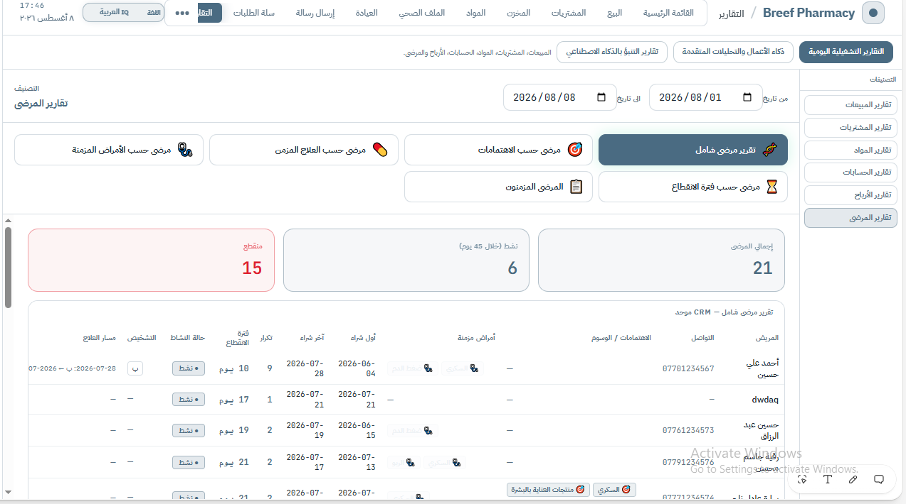
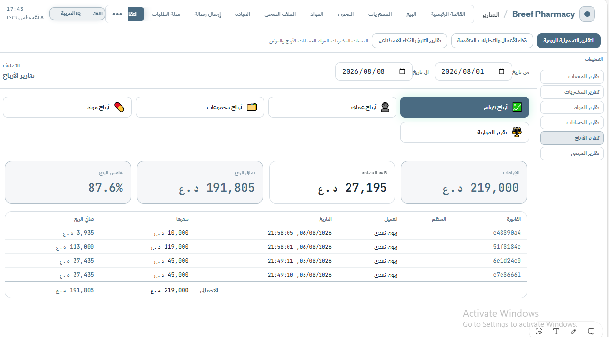

## Requirements

### 8.5 Profit reports using the Lovable prototype as the model

## Screenshot details

The upper screenshot is a patient-report example with report choices such as:

- Comprehensive patient report
- Visits by specialty/category
- Chronic medicines
- Patients with chronic conditions
- Patients nearing treatment/refill due dates
- Patient follow-up/visit patterns

The lower screenshot begins the Profit Reports examples and shows a **total profit** view with summary cards:

- Sales: **219,000 IQD**
- Total cost: **27,195 IQD**
- Net profit: **191,805 IQD**
- Profit margin: **87.6%**

A transaction table shows date/time, payment method, sale value, and profit.

---

# Page 39

## Page assets
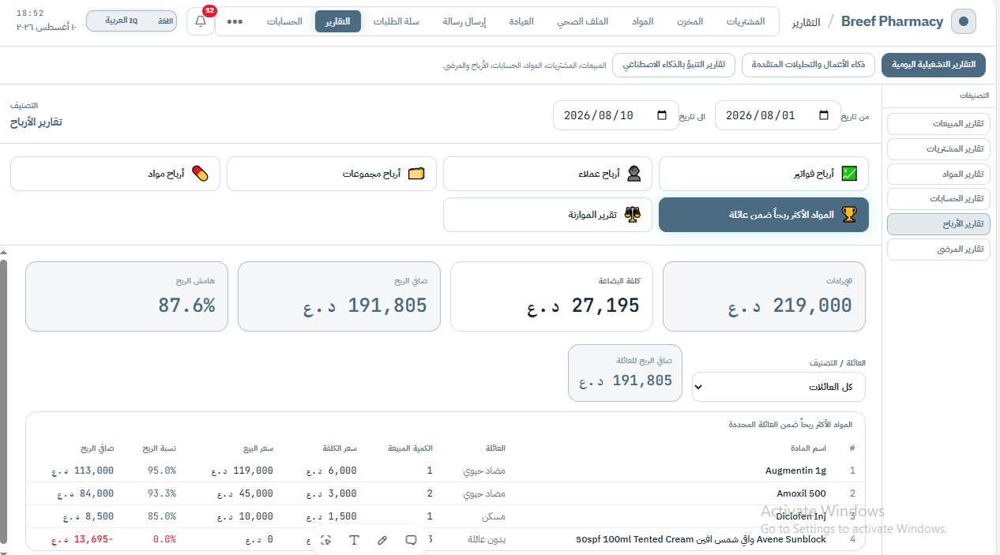

## Requirements

### 8.6 AI analytics

## Screenshot details

The screenshot shows another profit-analysis view, described as the **most profitable items / items by profitability**. It retains the same overall summary values shown on the preceding page:

- Sales: **219,000 IQD**
- Cost: **27,195 IQD**
- Profit: **191,805 IQD**
- Profit margin: **87.6%**

The item table ranks products by profitability and includes quantity sold, cost, selling price, margin percentage, and profit. Visible examples include **Augmentin 1g, Amoxil 500, Diclofen Inj**, and **Avene Sunblock**.

The page then introduces **AI Analytics**.

---

# Page 40

## Page assets
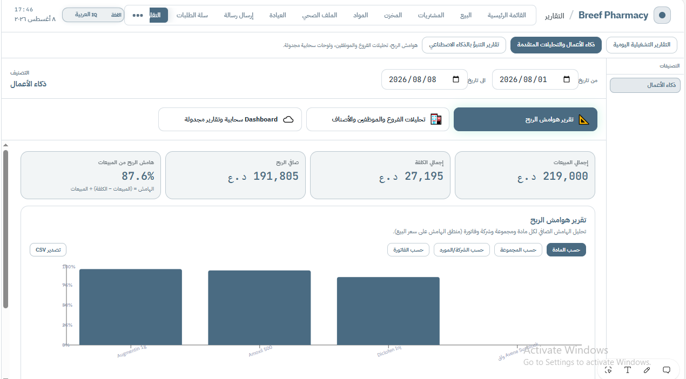
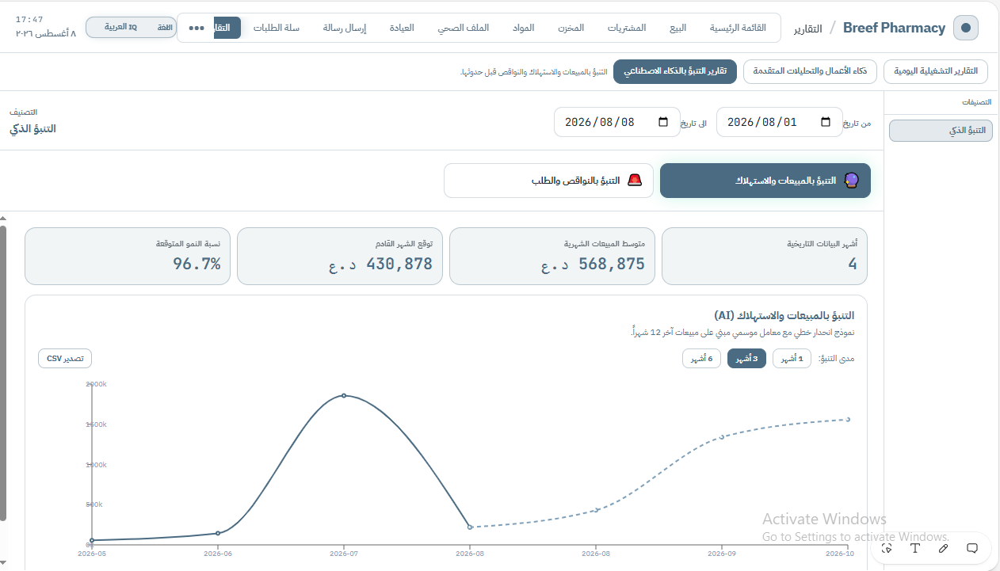

## Requirements and screenshot details

This image-only page shows two examples under advanced analytics/business intelligence.

### Profit-margin analysis

The upper screenshot contains a profit-margin report with summary cards:

- Total sales: **219,000 IQD**
- Total cost: **27,195 IQD**
- Net profit: **191,805 IQD**
- Profit margin: **87.6%**

It includes a chart for comparing profit margins and controls for choosing the calculation basis, such as overall, by group, or by other dimensions. CSV export is shown.

### Predictive forecasting and AI analytics

The lower screenshot shows an AI-driven **sales and inventory forecast** interface. Summary cards indicate values such as:

- Number of analyzed products: **4**
- Average monthly sales: **568,875 IQD**
- Expected future profit: **430,878 IQD**
- Forecast confidence: **96.7%**

A line chart compares historical and forecast values over time. A separate alert/forecast option is shown for expected stock shortages and reorder needs.

---

# Page 41

## Page assets
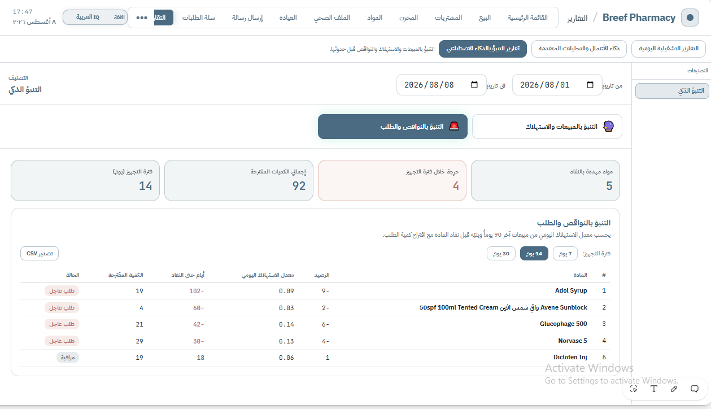

## Requirements

### 8.7 Accounts and cash-box reports

This area needs special clarification. The Lovable prototype may be used as an initial model, with one required addition: **the statement must show cost before discount and cost after discount**.

## Section 9: Accounts and cash-box transfers

The existing/current system can provide a clearer example of this workflow; the source notes that access can be provided through **AnyDesk**.

## Screenshot details

The screenshot above the text demonstrates an AI forecast for **stock depletion and demand**. It shows counts for expected out-of-stock items, critical shortage warnings, predicted quantities, and expected reorder needs, with item rows such as **Adol Syrup, Avene Sunblock, Glucophage 500, Norvasc 5, and Diclofen Inj**.

---

# Page 42

## Page assets
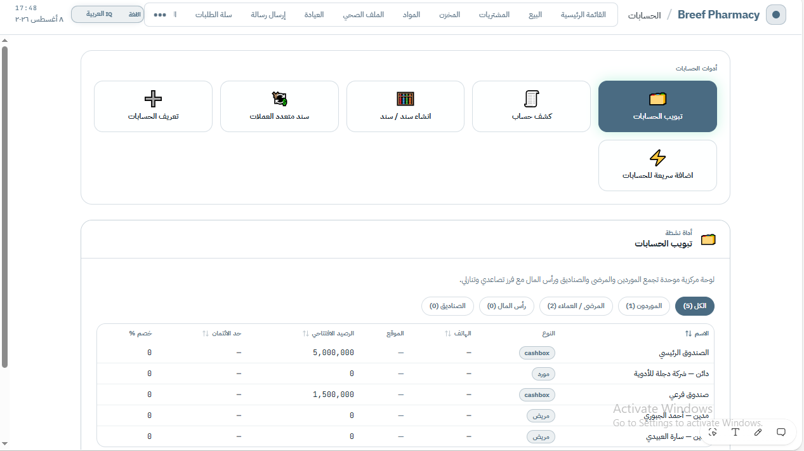
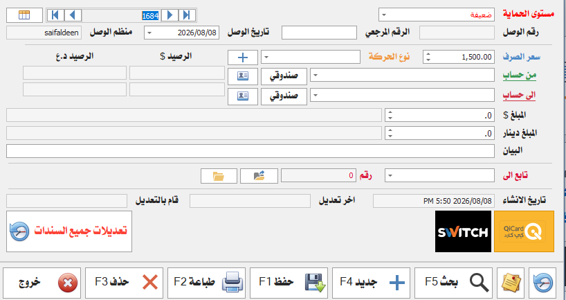

## Requirements and screenshot details

This image-only page contains the proposed **Accounts** interface and a reference screenshot from an existing accounting system.

### Proposed account actions

The upper interface presents quick actions including concepts equivalent to:

- View accounts
- Account statement
- Add/open a cash box or account
- Account definition/setup
- Account transfers
- Add/record account movement

A **Current Accounts** table is shown with account tabs/categories and columns for account name, type, balance, opening balance, and related values. The example includes a main cash register/cash-box balance of **5,000,000** and another cash-box example of **1,500,000**.

### Reference transfer and accounting voucher

The lower screenshot demonstrates the desired level of accounting detail. Visible fields include:

- Security/protection level, shown as **Weak** in the example
- Voucher/document number
- Reference number
- Voucher date
- Voucher organizer/user
- Exchange rate, shown as **1,500.00**
- Transaction/movement type
- **From account**
- **To account**
- Balance in USD
- Balance in IQD
- Amount in USD
- Amount in dinar
- Description/statement
- Related-to/reference field
- Creation date/time
- Last modification
- Modified by
- Full voucher-edit history

Keyboard actions shown include **Save F1, Print F2, Delete F3, New F4, Search F5**, and **Exit**.

---

# Page 43

## Page assets

## Requirements

## Section 10: Human resources and role-based access control

> The embedded caption says "SECTION 9," while the section heading identifies this as **Section 10**. This document follows the section heading and records the mismatch.

### Shift logging and RBAC

Employees can manually record attendance/check-in and departure/check-out times. Administrators can enable or disable workspace tabs according to the employee's role, such as pharmacist, accountant, or inventory administrator, using standard RBAC controls. In the future, check-in time may be captured through fingerprint/biometric hardware.

The system should allow tracking all movements/actions by employee. Selecting an employee should show every operation they performed, with filters by time and date and categories such as transactions, edits, and deletions, including detailed operation information.

## Section 11: External integration and cloud roadmap

Selected columns from the sales interface should be filtered/exposed on the external-integration page.

**E-Commerce Sync Roadmap.** REST APIs should be architecturally prepared in advance for future **two-way synchronization** with web/e-commerce stores.

**Targeted Marketing Webhooks.** Custom event hooks should support tracking marketing-campaign conversions and sending promotional offers.

# Page 44

## Requirements

## Notes about the system

1. The system must operate **fully offline when the network/internet connection is unavailable**.

2. When internet connectivity becomes available, it should synchronize with the server to update data. This also applies as the system is further developed.

3. The product is designed to be sold to multiple pharmacies under **monthly or annual subscriptions**, with different packages/plans. Subscription deductions/renewal should be automated. After a subscription expires, the system should switch to **view-only/read-only access**.

4. Add an offline-subscription protection mechanism that prevents manipulating the computer's date/time to bypass license expiry (**License Expiry & Anti-Clock Tampering Engine**). The designer/developer should remain available to resolve this issue if it occurs for a customer.

5. Development priority should remain with the original designer/development company. The designer commits to ongoing maintenance so the program remains free of errors. Payment is only required when an additional feature is requested for a specific interface or for the system, with the price agreed separately. If BREEV and the original designer cannot agree on such additional work, the programmer should cooperate by explaining to another programmer how the feature can be added.

6. Before implementation begins, determine the server cost for both **one-way and two-way synchronization**, as well as any subscription/service costs that may apply.

Data must be transferable from one server to another, and the designer/developer commits to facilitating the migration.

7. All rights and system details belong to **BREEV**. The source states that the **code is owned by BREEV** and that the designer/developer may not share, print, or transfer details of any interface. If system data/details are proven to have been shared with another party, BREEV reserves the right to pursue legal action.

### Proposed technical stack

- **Backend (Cloud):** Laravel 12 + PHP
- **Frontend (Desktop POS):** React.js / Vue.js wrapped in Electron.js
- **Local Database (Offline POS):** SQLite
- **Cloud Database:** PostgreSQL or MySQL
- **Sync Mechanism:** Bidirectional synchronization between SQLite and the cloud database
- **API:** REST API
- **Hosting:** AWS or DigitalOcean
- **Authentication:** JWT/Sanctum with role-based access control

## Definition of button behavior

### Sales interface

---

# Page 45

## Requirements

### First: Header and top-bar controls

**Item / Barcode Search (`Pick Item / Barcode Search`)**

Rapidly find an item by scanning its barcode or typing its scientific/generic or trade name, then immediately add it to the invoice grid.

**Diagnosis field**

An embedded field for entering the patient's diagnosis or a quick note, linking the invoice to the patient's medical diagnosis/context.

**Suspended Invoice Tabs (`Suspended #1 ...`)**

Quickly move between currently suspended invoices so a sale can be resumed without closing the current invoice.

### Second: Sales-invoice grid controls

**Unit selector arrow / box / strip**

Quickly switch between sales units, for example **pack / strip / single tablet/unit**. The selector arrow should appear only when the item has more than one unit.

**Quantity controls (`< 1 >` / increase-decrease buttons)**

Increase or decrease the sold quantity with one press instead of manually typing the value.

**Dose-frequency options (`D / W / M`, daily / weekly / monthly)**

Define how often the medicine is taken, daily, weekly, or monthly, so it can be linked to the patient's dosage and electronic prescription.

**Delete line/item (`X` / trash icon)**

Remove the selected item completely from the current invoice grid.

### Third: Invoice actions

**Cash**

Complete the transaction, receive payment in cash, close the invoice, and immediately print the receipt.

**Return, shown with a return-arrow icon**

Convert the invoice or selected item into a return and record the amount as returned/refunded for the patient.

**Suspend Invoice, shown with a pause icon**

Temporarily save the current invoice in the suspended-invoices area so another customer can be served and the invoice resumed later.

**Save Invoice, shown with a save icon**

---

# Page 46

## Requirements

**Save Invoice.** Save the invoice in the system archive without printing it immediately.

**Print, shown with a printer icon.** Send the current invoice directly to the thermal receipt printer.

**Delete Invoice, shown with a trash icon.** Cancel the entire current invoice and clear the grid so a new invoice can be started.

**Search, shown with a search icon.** Open an advanced search window for previous invoices, suspended invoices, or sales movements/history.

---

# Required pharmacy accounting and financial system

The accounting system must be built around **financial movements/transactions and a ledger**, not by directly editing final balances. Every operation must create a traceable, reviewable transaction.

## First: Main accounts

### 1. Assets

- Main cash box
- Sales cash box
- Separate cash/account balance for each employee
- Card/electronic-payment company accounts
- Patient receivables (credit sales)
- Medicine inventory

---

# Page 47

## Requirements

### Assets, continued

- Fixed assets

### 2. Liabilities

- Supplier accounts/payables
- Any other debts or obligations

### 3. Equity

- Capital
- Owner withdrawals/drawings
- Accumulated/retained earnings

### 4. Revenue

- Medicine sales

### 5. Cost of sales

- Cost of goods sold

### 6. Expenses

- Rent
- Generator
- Salaries
- Internet
- Water and electricity
- Tax

---

# Page 48

## Requirements

### Expenses, continued

- Municipal fees/collection charges
- ID/license renewal
- Maintenance
- Cleaning
- Refrigeration/cooling maintenance
- Fragrance/air freshener
- Other operating expenses
- Losses from expired medicines

## Second: Purchases and suppliers

Most purchases from suppliers are made **on credit**, with a smaller proportion paid in cash.

For each supplier, the system must track:

- Total invoices
- Total adjustments
- Total returns
- Total payments
- Total allowances/discounts
- Current balance
- Debt aging
- Statement of account filtered by date

---

# Page 49

## Requirements

## Third: Supplier cost

For every purchase invoice, the system must store **two separate cost values**.

### 1. Primary supplier cost

This is the full nominal invoice value **before allowance/discount**.

It is the system's primary reference cost and is used for:

- Inventory valuation
- Item average cost
- Internal operations
- Supplier payment/settlement logic
- The supplier's primary accounting balance

### 2. Supplier cost after discount

This is an informational/reference value calculated from the primary cost and the allowance/discount percentage stored on the invoice.

It appears beside the primary supplier cost in reports and supplier statements.

**Important.** The supplier cost after discount **does not replace or modify** the primary supplier cost.

---

# Page 50

## Requirements

## Fourth: Historical allowance or discount percentage

Each supplier has a default allowance/discount percentage on the Supplier Card, but that percentage can change over time.

Example:

- Up to a certain date: **10%**
- From a later date: **5%**

When entering an invoice, the system must use the allowance percentage that was valid on the **invoice date** and store that percentage inside the invoice itself as a **snapshot**.

Old invoices must not change when the default allowance percentage on the Supplier Card is later changed.

Example, Invoice 1:

- Invoice value: **1,000**
- Allowance at its date: **10%**
- Cost after discount: **900**

---

# Page 51

## Requirements

Example, Invoice 2:

- Invoice value: **1,000**
- Allowance at its date: **10%**
- Cost after discount: **900**

The supplier's default percentage is then changed from **10% to 5%**.

Invoice 3:

- Invoice value: **1,000**
- Allowance: **5%**
- Cost after discount: **950**

Invoice 4:

- **5% / 1,000**

Invoice 5:

- **5% / 1,000**

Therefore:

- Total primary supplier cost = **5,000**
- Total supplier cost after discount = **900 + 900 + 950 + 950 + 950**

---

# Page 52

## Requirements

The total supplier cost after discount is:

**4,650**

Both totals must be displayed separately.

## Fifth: Invoice allowance or discount

The default allowance percentage stored on the Supplier Card should be inserted automatically when an invoice is created, using the percentage valid on that invoice's date.

The invoice must store:

- Primary cost
- Allowance percentage
- Allowance amount
- Cost after discount

The system must also support an additional invoice-specific discount/offer when needed.

## Sixth: Adjusting the allowance for exceptional offers

An exclusive or emergency/exceptional supplier offer may occur at the time of settlement/payment.

---

# Page 53

## Requirements

Example:

- Total primary supplier cost = **5,000**
- According to the historical allowance percentages, cost after discount = **4,650**
- At full settlement, the supplier grants an additional discount so the amount actually required for payment becomes **4,500**

Therefore:

- Actual allowance = **500**
- Allowance previously calculated from the invoices = **350**
- Difference = **150**

The supplier payment voucher therefore needs a separate field named:

- **Allowance Difference**, or
- **Actual Allowance Adjustment**

This field is used only when the actual allowance obtained during full settlement differs from the allowance previously calculated from the invoices.

Example continues on the next page.

---

# Page 54

## Requirements

Example:

- Calculated allowance = **350**
- Actual allowance = **500**
- Allowance difference = **150**

This difference must **not** modify the original invoices, change the historical allowance percentages, or recalculate the item's average cost.

## Seventh: Supplier payment voucher

A supplier payment must **not necessarily be tied to one invoice**.

Invoices are purchased/entered daily, and after some time a group of invoices may be settled for a selected date range.

The payment may cover invoices that are:

- 30 days old
- 60 days old
- Or older

The pharmacy may also fully settle/zero the supplier's entire account.

Therefore, the payment voucher must allow selection of:

**From account:**

---

# Page 55

## Requirements

**From account:**

- Main cash box
- Or whichever cash account is being used

**To:**

- Supplier

The voucher must contain:

- Amount paid
- Actual allowance percentage
- Actual allowance amount
- Allowance difference / allowance adjustment
- Notes
- Date
- User

---

# Page 56

## Page assets
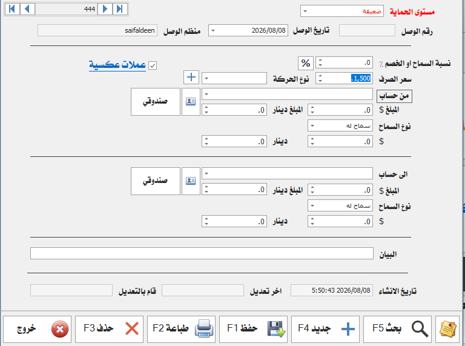

## Requirements

Add an **Allowance Difference** field.

Example:

- Primary supplier cost = **5,000**
- Calculated allowance = **350**
- Actual allowance at full settlement = **500**
- Amount paid = **4,500**

The supplier balance then becomes **zero**.

The system must preserve the complete history of the transaction.

---

# Page 57

## Requirements

## Eighth: Allowance at payment or settlement

The supplier payment voucher should contain two allowance fields:

1. **Allowance percentage**
2. **Allowance amount**

The user must be able to enter the actual value received from the supplier.

When one of the two values is entered or changed, the other should update automatically.

Example:

- Supplier balance = **1,000,000**
- Allowance = **1%**
- Allowance amount = **10,000**
- Amount paid = **990,000**

The accounting entry/transaction must completely settle the supplier account.

This allowance must **not** be treated as a return.

---

# Page 58

## Requirements

An allowance granted at settlement is a **separate transaction type**.

## Ninth: Purchase return

A purchase return is completely different from an invoice adjustment.

A purchase return means the goods physically leave the pharmacy and are sent back to the supplier.

The system must support:

- Full return
- Partial return

The return must be linked to the original invoice.

When a return occurs, the system must:

- Reduce inventory
- Reduce the supplier account balance
- Record the return value separately
- Leave the original invoice unchanged

The supplier statement must show the return in a dedicated column.

---

# Page 59

## Requirements

## Tenth: Purchase-invoice adjustment

After an invoice is approved, it must **not be edited directly**.

When the user selects **Edit Invoice**:

- Create an adjustment draft linked to the original invoice.
- Show a complete editable copy of the invoice.
- After save, compare the original invoice with the edited version.
- Extract and record **only the difference (Delta)**.

Example:

- Original quantity = **4**
- Edited quantity = **6**

---

# Page 60

## Requirements

The difference is:

**+2**

Only a **+2 movement** is recorded.

If:

- Original quantity = **5**
- Edited quantity = **3**

Then:

- Difference = **-2**

Only a **-2 movement** is recorded.

Items that did not change must not receive an adjustment movement.

The original invoice is never deleted or altered.

## Eleventh: Adjustments linked to an invoice

Example invoice:

**#10025**

It may have the following linked adjustments:

---

# Page 61

## Requirements

- **#10025-A01**
- **#10025-A02**
- **#10025-A03**

All linked adjustments must be displayed beneath the original invoice.

Each adjustment should show:

- Adjustment number
- Date
- Time
- User
- Reason
- Adjustment value

From an adjustment, the user must be able to navigate to the original invoice.

From the original invoice, the user must be able to open its linked adjustments.

## Twelfth: Preventing repeated adjustments

When an invoice adjustment is started, create a **Draft**.

---

# Page 62

## Requirements

If the user leaves before saving, show:

> **"There is an incomplete adjustment draft for this invoice."**

Available actions:

- Continue adjustment
- Delete draft

A final adjustment is created only after save and confirmation.

Before final save, show a summary containing:

- Quantities before and after
- Prices before and after
- Invoice value before and after
- Difference amount/value
- Impact of the adjustment

Then require:

> **Confirm and Save Adjustment**

## Thirteenth: Supplier statement

---

# Page 63

## Requirements

Example: supplier **"Al-Manara"**.

Assume the pharmacy:

- Purchased **8 invoices** from this supplier
- Adjusted **1 invoice**
- Returned part of **2 invoices**

The supplier statement should clearly show:

- Date
- Document number
- Transaction type
- Primary invoice cost
- Adjustment
- Return
- Payment
- Allowance
- Allowance difference
- Balance

The invoice, adjustment, return, payment, and allowance must each appear as **separate transactions/movements**.

At the top of the statement, show:

- Total invoices

---

# Page 64

## Requirements

Supplier-statement summary, continued:

- Total adjustments
- Total returns
- Total payments
- Total allowances
- Total allowance differences
- Current balance

The user must be able to select a time period and determine the value of returns, adjustments, and payments during that period.

## Fourteenth: Debt aging

Provide a supplier debt-aging report with buckets:

- **0-30 days**
- **31-60 days**
- **61-90 days**
- **More than 90 days**

Show:

- Total for each aging bucket
- Total debt owed to the supplier

**Note.** The number of days before a payment reminder/alert is generated should be configurable from the supplier/wholesaler definition interface.

---

# Page 65

## Requirements

## Fifteenth: Sales

Supported payment methods:

1. Cash
2. Card
3. Credit/debt sales to a small number of known people/patients

There is **no general open credit-sale facility for all customers**.

## Sixteenth: Card payments

Card payments are used only for patients/customers.

Suppliers are **not paid by card**.

For a card sale, the system must separate:

- Sale value

---

# Page 66

## Requirements

For card sales, separate:

- Card/payment-service commission
- Net amount received

Example:

- Sale value = **1,000,000**
- Card commission = **10,000**
- Net received = **990,000**

Sales revenue remains **1,000,000**.

The **10,000** is recorded as an electronic-payment commission/service cost, **not as a discount granted to the patient**.

There may be offers where the commission is zero.

Example:

- Sale value = **1,000,000**
- Commission = **0**
- Net received = **1,000,000**

## Seventeenth: Inventory

---

# Page 67

## Requirements

The system calculates:

- Inventory quantity
- Inventory value
- Average cost
- Cost of goods sold
- Profit

The item's **average cost** is based on the **primary supplier cost before discount**.

Supplier cost after discount remains an additional value for display, review, and supplier statements; it does **not replace the primary inventory cost basis**.

## Eighteenth: Expiry

Expired medicines must be recorded as a **separate loss**.

Example:

- Expiry loss = **150,000**

This reduces inventory value and is recorded under:

---

# Page 68

## Requirements

**"Expired Medicine Losses"**

It is **not** treated as a supplier return.

## Nineteenth: Expenses

The system must support:

- Rent
- Generator
- Salaries
- Internet
- Water and electricity
- Tax
- Municipal fees/collection
- ID/license renewal
- Maintenance
- Cleaning
- Refrigeration/cooling maintenance
- Fragrance/air freshener
- Other expenses
- Expiry losses

---

# Page 69

## Requirements

## Twentieth: Capital and owner withdrawals

The pharmacy's capital must be recorded independently.

Owner withdrawals/drawings must also be recorded independently from pharmacy operating expenses.

## Twenty-first: Required reports

The system must provide the following information.

### Suppliers

- Total debt/payables
- Debt owed to each supplier
- Debt age
- Total purchases
- Total returns
- Total adjustments
- Total allowances
- Total allowance differences

---

# Page 70

## Requirements

### Suppliers, continued

- Total payments

### Inventory

- Inventory quantity
- Inventory value
- Average cost
- Cost of goods sold

### Sales

- Total sales
- Cash sales
- Card sales
- Card commissions
- Credit sales
- Patient receivables/debts

### Expenses

- Total expenses
- Expenses by type
- Expiry losses

### Financial position

- Cash boxes
- Employee balances/accounts

---

# Page 71

## Requirements

### Financial position, continued

- Suppliers
- Patient debts/receivables
- Liabilities
- Capital
- Withdrawals
- Profit

## Fundamental system rule

Final balances must **not be edited directly**.

The source of truth must be the **Transactions/Ledger**.

Every business operation creates its own independent, traceable movement, including:

- Purchase
- Purchase adjustment
- Purchase return
- Supplier payment
- Supplier allowance
- Allowance difference
- Cash sale

---

# Page 72

## Requirements

Additional transaction types include:

- Card sale
- Credit sale
- Debt collection
- Expense
- Expiry loss
- Inventory adjustment/reconciliation
- Capital contribution
- Owner withdrawal

All movements must be linked to the original document when one exists, with:

- Transaction number
- Date and time
- User
- Reason/note when needed
- Reference document
- Value/amount
- Effect on accounts

Approved historical movements must not be deleted or edited directly. Corrections must be made through a **new corrective transaction**.

## Mandatory system test example

---

# Page 73

## Requirements

There are **5 invoices**, each with a value of **1,000**.

- Invoice 1: **10% allowance**
- Invoice 2: **10% allowance**

Then the default allowance on the Supplier Card changes to **5%**.

- Invoice 3: **5%**
- Invoice 4: **5%**
- Invoice 5: **5%**

Therefore:

- Primary supplier cost = **5,000**

Supplier cost after discount:

**900 + 900 + 950 + 950 + 950 = 4,650**

At payment/settlement, the supplier gives an exceptional full-settlement offer so only **4,500** must be paid.

Therefore:

- Actual allowance = **500**
- Allowance calculated from the invoices = **350**

---

# Page 74

## Requirements

- Allowance difference = **150**

The system must be able to record all of the following simultaneously:

- Primary cost = **5,000**
- Calculated cost after discount = **4,650**
- Amount paid = **4,500**
- Actual allowance = **500**
- Allowance difference = **150**
- Final supplier balance = **zero**

All original invoices and their historical allowance percentages must remain unchanged.

**Very important.** The exceptional full-settlement offer must **not change the item cost and must not recalculate the historical average inventory cost**.
