# Recovered UI and Domain Workflow Map

These workflows reconcile client intent with the prototype. They describe target behavior and invariants; they are not implementation specifications or authorization to code.

## System entry and capability evaluation

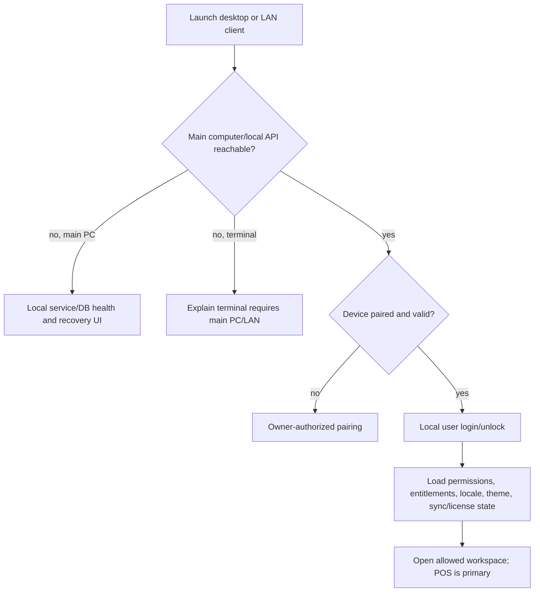
```mermaid
flowchart TD
  Start[Launch desktop or LAN client] --> Health{Main computer/local API reachable?}
  Health -- no, main PC --> Repair[Local service/DB health and recovery UI]
  Health -- no, terminal --> OfflineTerminal[Explain terminal requires main PC/LAN]
  Health -- yes --> Device{Device paired and valid?}
  Device -- no --> Pair[Owner-authorized pairing]
  Device -- yes --> Login[Local user login/unlock]
  Login --> Context[Load permissions, entitlements, locale, theme, sync/license state]
  Context --> Home[Open allowed workspace; POS is primary]
```

UI hiding is convenience. The local/cloud API and background job must repeat permission, entitlement, tenant, actor, and device checks.

### Pair, replace, or revoke an additional terminal

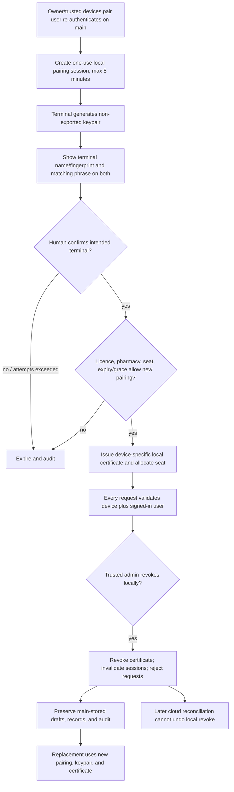
```mermaid
flowchart TD
  Admin[Owner/trusted devices.pair user re-authenticates on main] --> Session[Create one-use local pairing session, max 5 minutes]
  Session --> Terminal[Terminal generates non-exported keypair]
  Terminal --> Compare[Show terminal name/fingerprint and matching phrase on both]
  Compare --> Approve{Human confirms intended terminal?}
  Approve -- no / attempts exceeded --> Reject[Expire and audit]
  Approve -- yes --> Licence{Licence, pharmacy, seat, expiry/grace allow new pairing?}
  Licence -- no --> Reject
  Licence -- yes --> Cert[Issue device-specific local certificate and allocate seat]
  Cert --> Use[Every request validates device plus signed-in user]
  Use --> Revoke{Trusted admin revokes locally?}
  Revoke -- yes --> Block[Revoke certificate; invalidate sessions; reject requests]
  Block --> Preserve[Preserve main-stored drafts, records, and audit]
  Preserve --> Replace[Replacement uses new pairing, keypair, and certificate]
  Block --> Reconcile[Later cloud reconciliation cannot undo local revoke]
```

The private key never leaves the terminal. No database/admin credential, shared key, or reusable pairing secret is transferred. A disconnected revoked terminal may still display its local screen but cannot make a successful request. A draft never transmitted from a lost terminal cannot be recovered; normal drafts are persisted to the Main Pharmacy Computer whenever LAN is available.

### Discover and authenticate the Main Pharmacy Computer

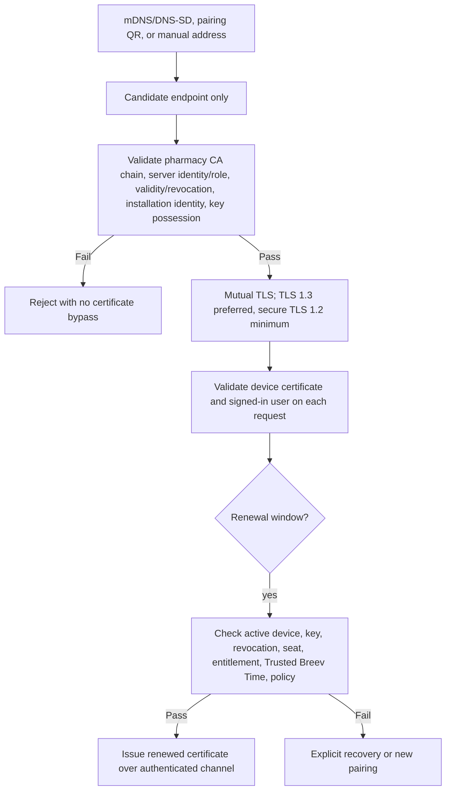
```mermaid
flowchart TD
  Locate[mDNS/DNS-SD, pairing QR, or manual address] --> Candidate[Candidate endpoint only]
  Candidate --> Validate[Validate pharmacy CA chain, server identity/role, validity/revocation, installation identity, key possession]
  Validate -->|Fail| Reject[Reject with no certificate bypass]
  Validate -->|Pass| MTLS[Mutual TLS; TLS 1.3 preferred, secure TLS 1.2 minimum]
  MTLS --> Request[Validate device certificate and signed-in user on each request]
  Request --> Renew{Renewal window?}
  Renew -- yes --> Checks[Check active device, key, revocation, seat, entitlement, Trusted Breev Time, policy]
  Checks -->|Pass| Issue[Issue renewed certificate over authenticated channel]
  Checks -->|Fail| Recovery[Explicit recovery or new pairing]
```

Discovery publishes only a generic service type, opaque installation identifier, address/port, and minimal protocol metadata. No plaintext/anonymous TLS, warning bypass, accept-any-certificate mode, TLS 1.3 0-RTT, or permanent IP trust exists. Planned CA rotation uses finite dual trust; suspected compromise retires the chain immediately and requires owner-confirmed re-pairing.

## POS sale

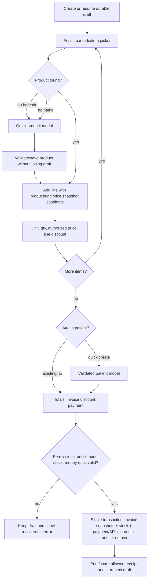
```mermaid
flowchart TD
  New[Create or resume durable draft] --> Scan[Focus barcode/item picker]
  Scan --> Known{Product found?}
  Known -- no barcode --> QuickItem[Quick product modal]
  Known -- no name --> QuickItem
  QuickItem --> ValidateItem[Validate/save product without losing draft]
  ValidateItem --> Line
  Known -- yes --> Line[Add line with product/unit/price snapshot candidate]
  Line --> Edit[Unit, qty, authorized price, line discount]
  Edit --> More{More items?}
  More -- yes --> Scan
  More -- no --> Patient{Attach patient?}
  Patient -- quick create --> QuickPatient[Validated patient modal]
  Patient -- existing/no --> Review[Totals, invoice discount, payment]
  QuickPatient --> Review
  Review --> Authorize{Permissions, entitlement, stock, money rules valid?}
  Authorize -- no --> Stay[Keep draft and show recoverable error]
  Authorize -- yes --> Post[Single transaction: invoice snapshots + stock + payment/AR + journal + audit + outbox]
  Post --> Receipt[Print/share allowed receipt and start next draft]
```

### Peripheral failure after or during sale

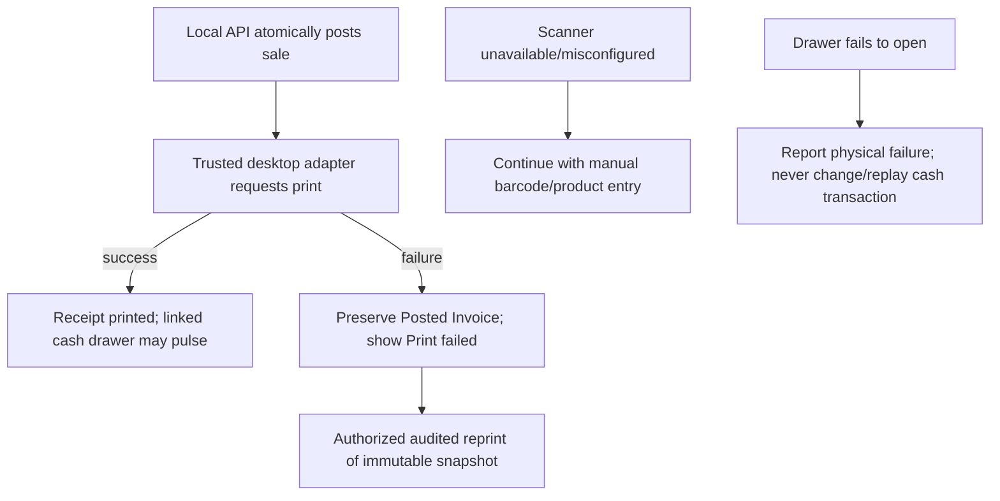
```mermaid
flowchart TD
  Post[Local API atomically posts sale] --> Print[Trusted desktop adapter requests print]
  Print -->|success| Receipt[Receipt printed; linked cash drawer may pulse]
  Print -->|failure| Failed[Preserve Posted Invoice; show Print failed]
  Failed --> Reprint[Authorized audited reprint of immutable snapshot]
  Scan[Scanner unavailable/misconfigured] --> Manual[Continue with manual barcode/product entry]
  Drawer[Drawer fails to open] --> Physical[Report physical failure; never change/replay cash transaction]
```

Peripheral reconnect, test, or retry never re-executes the business command. Manual drawer opening is a distinct permissioned/audited operation. Only models in the current Certified Hardware Profile receive a production support guarantee.

Recovered prototype gaps: suspended drafts are only in memory; unknown barcode is ignored; quick patient uses `prompt`; extra items can lack product identity; headers/lines are separate writes; cost/profit is broadly visible; Telegram/SMS and heuristic clinical suggestions must not be ported.

### Future external electronic payment

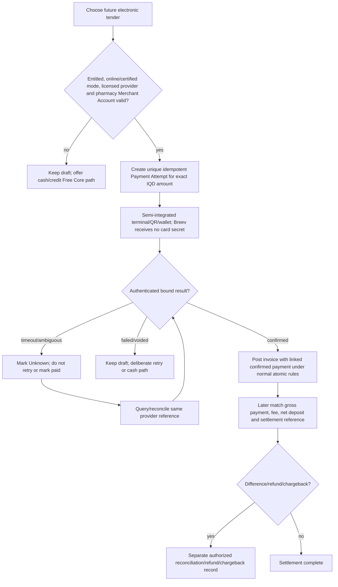
```mermaid
flowchart TD
  Pay[Choose future electronic tender] --> Gate{Entitled, online/certified mode, licensed provider and pharmacy Merchant Account valid?}
  Gate -- no --> Cash[Keep draft; offer cash/credit Free Core path]
  Gate -- yes --> Attempt[Create unique idempotent Payment Attempt for exact IQD amount]
  Attempt --> Provider[Semi-integrated terminal/QR/wallet; Breev receives no card secret]
  Provider --> Result{Authenticated bound result?}
  Result -- confirmed --> Post[Post invoice with linked confirmed payment under normal atomic rules]
  Result -- failed/voided --> Retry[Keep draft; deliberate retry or cash path]
  Result -- timeout/ambiguous --> Unknown[Mark Unknown; do not retry or mark paid]
  Unknown --> Query[Query/reconcile same provider reference]
  Query --> Result
  Post --> Settle[Later match gross payment, fee, net deposit and settlement reference]
  Settle --> Difference{Difference/refund/chargeback?}
  Difference -- yes --> Resolve[Separate authorized reconciliation/refund/chargeback record]
  Difference -- no --> Complete[Settlement complete]
```

A Return or Reversal can initiate a Provider Refund, but the business correction and movement of external money retain separate states and evidence. Expiry stops new paid initiation while preserving safe resolution of pre-expiry attempts. Cash and manual core operation remain available; provider-specific offline acceptance exists only when that provider certifies it.

### Existing draft after a selling-price change

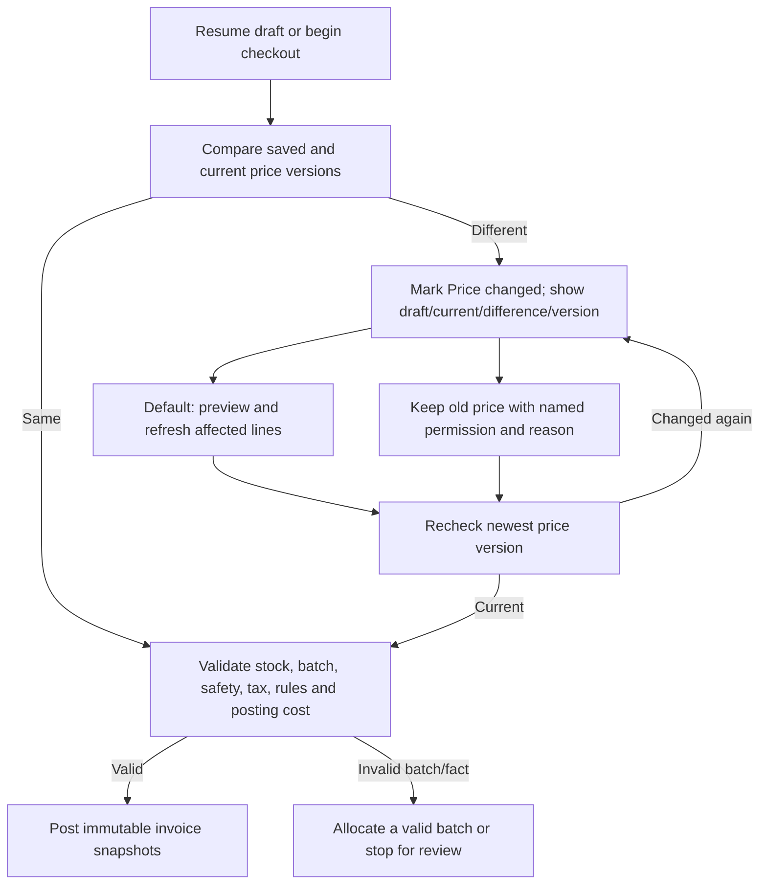
```mermaid
flowchart TD
  Resume[Resume draft or begin checkout] --> Compare[Compare saved and current price versions]
  Compare -->|Same| Validate[Validate stock, batch, safety, tax, rules and posting cost]
  Compare -->|Different| Warn[Mark Price changed; show draft/current/difference/version]
  Warn --> Refresh[Default: preview and refresh affected lines]
  Warn --> Keep[Keep old price with named permission and reason]
  Refresh --> Recheck[Recheck newest price version]
  Keep --> Recheck
  Recheck -->|Changed again| Warn
  Recheck -->|Current| Validate
  Validate -->|Valid| Post[Post immutable invoice snapshots]
  Validate -->|Invalid batch/fact| Review[Allocate a valid batch or stop for review]
```

The draft preserves only the commercial selling-price proposal. It never forces outdated availability, expiry/recall/quarantine status, restrictions, taxes, carrying cost, or COGS into the posted transaction.

## Purchase entry and OCR

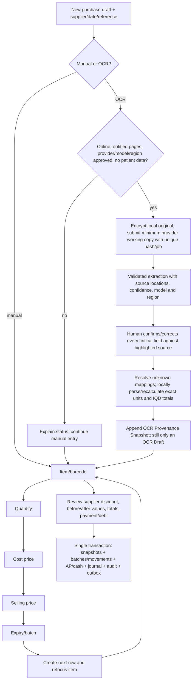
```mermaid
flowchart TD
  Draft[New purchase draft + supplier/date/reference] --> Source{Manual or OCR?}
  Source -- manual --> Item[Item/barcode]
  Source -- OCR --> Gate{Online, entitled pages, provider/model/region approved, no patient data?}
  Gate -- no --> Manual[Explain status; continue manual entry]
  Manual --> Item
  Gate -- yes --> Upload[Encrypt local original; submit minimum provider working copy with unique hash/job]
  Upload --> Extract[Validated extraction with source locations, confidence, model and region]
  Extract --> Human[Human confirms/corrects every critical field against highlighted source]
  Human --> Local[Resolve unknown mappings; locally parse/recalculate exact units and IQD totals]
  Local --> Provenance[Append OCR Provenance Snapshot; still only an OCR Draft]
  Provenance --> Item
  Item --> Qty[Quantity]
  Qty --> Cost[Cost price]
  Cost --> Sell[Selling price]
  Sell --> Expiry[Expiry/batch]
  Expiry --> Next[Create next row and refocus item]
  Next --> Item
  Item --> Review[Review supplier discount, before/after values, totals, payment/debt]
  Review --> Post[Single transaction: snapshots + batches/movements + AP/cash + journal + audit + outbox]
```

OCR never bypasses the ordinary review/post transaction and provider confidence never means acceptance. It cannot create products/suppliers/batches, stock, price/cost changes, payments, or journals. Warn at 80% of the page allowance, stop external jobs without automatic overage at 100%, and keep manual entry available through offline/provider/quota/subscription failure. Provider working copies/results delete promptly within the approved 30-day cap; the encrypted local invoice linked to a posted purchase becomes retained Supplier Invoice Evidence.

## Stock count and adjustment

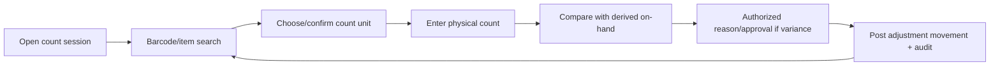
```mermaid
flowchart LR
  Start[Open count session] --> Scan[Barcode/item search]
  Scan --> Unit[Choose/confirm count unit]
  Unit --> Count[Enter physical count]
  Count --> Compare[Compare with derived on-hand]
  Compare --> Reason[Authorized reason/approval if variance]
  Reason --> Movement[Post adjustment movement + audit]
  Movement --> Scan
```

The count changes inventory through a movement, never a direct `quantity_in_stock` update. Multi-unit conversions use approved integer ratios.

If a POS sale would make stock negative, Breev keeps the draft, blocks posting, and offers an authorized quick count/correction. The manager records physical count, reason, and evidence as a stock movement before the sale retries; Breev never hides the discrepancy inside the sale.

## Expiry, quarantine, recall, and disposition

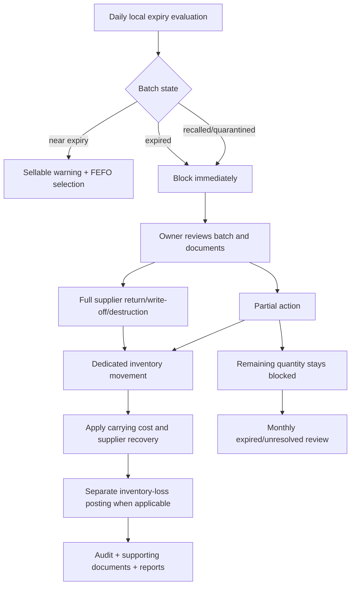
```mermaid
flowchart TD
  Daily[Daily local expiry evaluation] --> State{Batch state}
  State -- near expiry --> Warn[Sellable warning + FEFO selection]
  State -- expired --> Block[Block immediately]
  State -- recalled/quarantined --> Block
  Block --> Decide[Owner reviews batch and documents]
  Decide --> Full[Full supplier return/write-off/destruction]
  Decide --> Partial[Partial action]
  Partial --> Hold[Remaining quantity stays blocked]
  Full --> Move[Dedicated inventory movement]
  Partial --> Move
  Move --> Cost[Apply carrying cost and supplier recovery]
  Cost --> Loss[Separate inventory-loss posting when applicable]
  Loss --> Audit[Audit + supporting documents + reports]
  Hold --> Monthly[Monthly expired/unresolved review]
```

- Expired, recalled, and quarantined medicine has no checkout override. A batch-date input error is corrected by an authorized pharmacist/manager on the batch with evidence; the original value remains in audit.
- Expired/damaged write-off is not a zero-price sale. It has no sales revenue, sales gross-profit/margin, or Cash Box effect.
- The expiry loss posts on the expiry date when the daily job identifies it, or on discovery date when found late. Monthly/yearly reports accumulate it under a separate “Expired and Damaged Inventory Loss” line.
- Quarantine creates no loss until final disposition. Recall loss is only the carrying amount not recovered from the supplier.
- The posted movement permanently snapshots physical batch, quantity, posting-time unit carrying cost, total loss, and valuation method. WAC uses current exact WAC; FIFO uses applicable layer(s). Later purchases or recalculation never rewrite that snapshot.
- Daily-job failure is visible and retries on restart; a monthly review catches expired or unresolved batches.

## Posted invoice correction

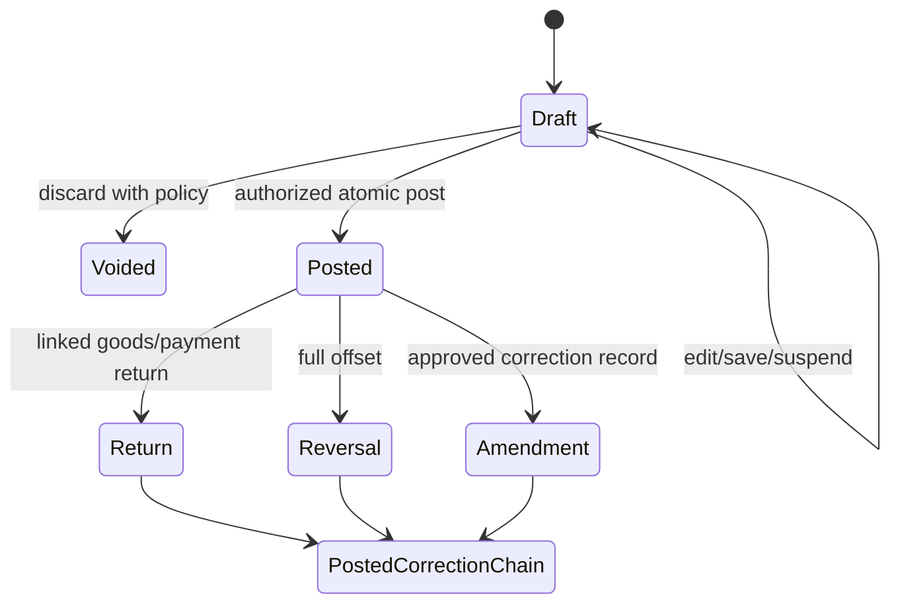
```mermaid
stateDiagram-v2
  [*] --> Draft
  Draft --> Draft: edit/save/suspend
  Draft --> Voided: discard with policy
  Draft --> Posted: authorized atomic post
  Posted --> Return: linked goods/payment return
  Posted --> Reversal: full offset
  Posted --> Amendment: approved correction record
  Return --> PostedCorrectionChain
  Reversal --> PostedCorrectionChain
  Amendment --> PostedCorrectionChain
```

No transition hard-deletes or overwrites a Posted document. Reversal requires re-authentication and the named `sales.invoice.reverse` permission, assigned to the owner by default and optionally delegated to a trusted manager. Exact number series remains Q-005B.

- **Return:** goods actually come back (or go back to a supplier); creates a partial/full linked return with stock, refund/debt, journal, audit, and printable return slip. It uses a separate permission from reversal; no-invoice returns require an additional elevated permission and evidence.
- **Reversal:** accounting-safe cancellation of a wrongly posted invoice; creates a full linked offset for stock, payment/receivable/payable, journal, audit, and a printable reversal slip. The original stays visible and is marked as reversed.
- **Replacement:** a new correct invoice linked after a reversal when the transaction should still exist.

### Future official electronic-tax-invoice submission

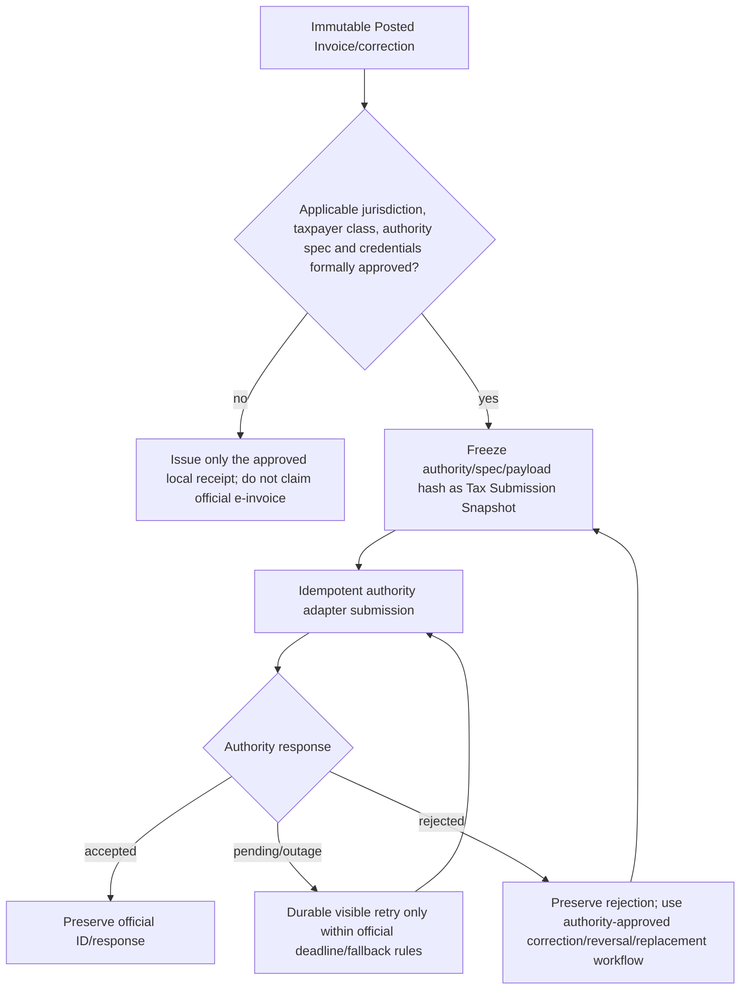
```mermaid
flowchart TD
  Posted[Immutable Posted Invoice/correction] --> Gate{Applicable jurisdiction, taxpayer class, authority spec and credentials formally approved?}
  Gate -- no --> Receipt[Issue only the approved local receipt; do not claim official e-invoice]
  Gate -- yes --> Snapshot[Freeze authority/spec/payload hash as Tax Submission Snapshot]
  Snapshot --> Submit[Idempotent authority adapter submission]
  Submit --> Result{Authority response}
  Result -- accepted --> Accepted[Preserve official ID/response]
  Result -- pending/outage --> Queue[Durable visible retry only within official deadline/fallback rules]
  Result -- rejected --> Correct[Preserve rejection; use authority-approved correction/reversal/replacement workflow]
  Queue --> Submit
  Correct --> Snapshot
```

Federal tax, Kurdistan government billing, and customs invoice-verification systems are not treated as interchangeable. No receipt, PDF, QR code, digital signature, or queued upload is described as an Official Electronic Tax Invoice until the responsible authority and Iraqi legal/accounting reviewers validate that exact workflow.

## Continuous Cash Box

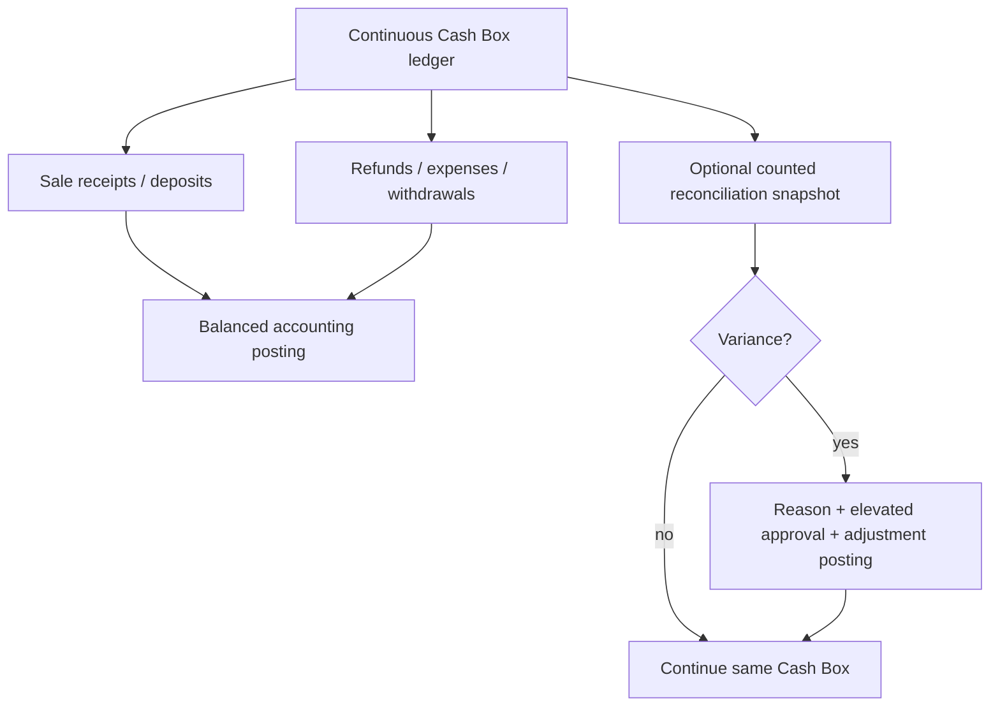
```mermaid
flowchart TD
  Box[Continuous Cash Box ledger] --> In[Sale receipts / deposits]
  Box --> Out[Refunds / expenses / withdrawals]
  In --> Ledger[Balanced accounting posting]
  Out --> Ledger
  Box --> Snapshot[Optional counted reconciliation snapshot]
  Snapshot --> Variance{Variance?}
  Variance -- yes --> Approval[Reason + elevated approval + adjustment posting]
  Variance -- no --> Continue[Continue same Cash Box]
  Approval --> Continue
```

A staff shift may later be reporting metadata, but it cannot be a forced prerequisite for a sale.

## Patient identity, profile, and consent

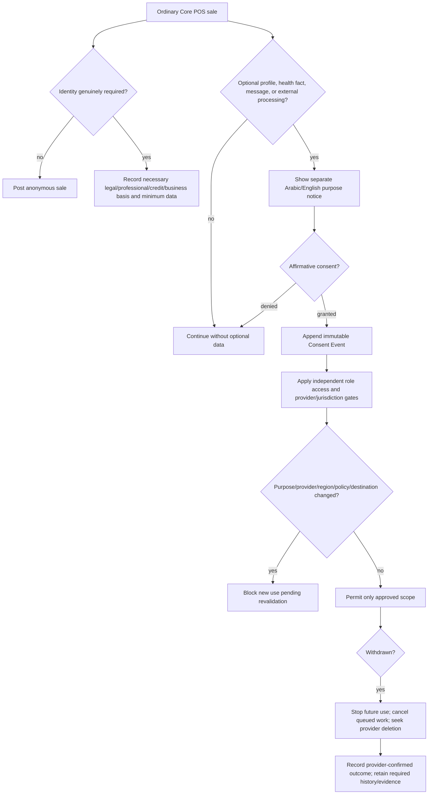
```mermaid
flowchart TD
  Sale[Ordinary Core POS sale] --> Need{Identity genuinely required?}
  Need -- no --> Anonymous[Post anonymous sale]
  Need -- yes --> Basis[Record necessary legal/professional/credit/business basis and minimum data]
  Sale --> Optional{Optional profile, health fact, message, or external processing?}
  Optional -- no --> Continue[Continue without optional data]
  Optional -- yes --> Purpose[Show separate Arabic/English purpose notice]
  Purpose --> Choice{Affirmative consent?}
  Choice -- denied --> Continue
  Choice -- granted --> Event[Append immutable Consent Event]
  Event --> Access[Apply independent role access and provider/jurisdiction gates]
  Access --> Change{Purpose/provider/region/policy/destination changed?}
  Change -- yes --> Block[Block new use pending revalidation]
  Change -- no --> Use[Permit only approved scope]
  Use --> Withdraw{Withdrawn?}
  Withdraw -- yes --> Stop[Stop future use; cancel queued work; seek provider deletion]
  Stop --> Evidence[Record provider-confirmed outcome; retain required history/evidence]
```

Posted invoice identity remains an immutable transaction fact under its applicable basis; it does not automatically create or extend a longitudinal Patient Profile. Consent never grants staff access. Guardian/proxy rules, patient health profiles, external patient-data processing, and medicine messaging remain release-gated by Iraqi legal and pharmacist validation.

### Clinical medicine-safety evaluation

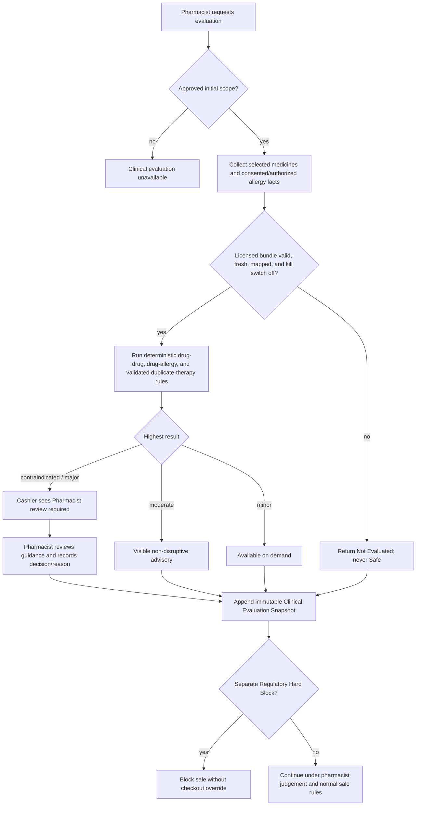
```mermaid
flowchart TD
  Trigger[Pharmacist requests evaluation] --> Scope{Approved initial scope?}
  Scope -- no --> Unavailable[Clinical evaluation unavailable]
  Scope -- yes --> Inputs[Collect selected medicines and consented/authorized allergy facts]
  Inputs --> Ready{Licensed bundle valid, fresh, mapped, and kill switch off?}
  Ready -- no --> NotEval[Return Not Evaluated; never Safe]
  Ready -- yes --> Evaluate[Run deterministic drug-drug, drug-allergy, and validated duplicate-therapy rules]
  Evaluate --> Severity{Highest result}
  Severity -- contraindicated / major --> Cashier[Cashier sees Pharmacist review required]
  Cashier --> Pharmacist[Pharmacist reviews guidance and records decision/reason]
  Severity -- moderate --> Moderate[Visible non-disruptive advisory]
  Severity -- minor --> Minor[Available on demand]
  Pharmacist --> Snapshot[Append immutable Clinical Evaluation Snapshot]
  Moderate --> Snapshot
  Minor --> Snapshot
  NotEval --> Snapshot
  Snapshot --> SaleGate{Separate Regulatory Hard Block?}
  SaleGate -- yes --> Block[Block sale without checkout override]
  SaleGate -- no --> Continue[Continue under pharmacist judgement and normal sale rules]
```

Clinical Alerts are advisory and may be overridden only by a pharmacist with a reason; they never diagnose, prescribe, or determine dosage. Official recall, expiry, quarantine, and validated regulatory controls remain non-overridable hard blocks. Clinical content is checked daily: after 30 days stale the pharmacist/owner sees a persistent warning; after 90 days evaluation is unavailable/`Not Evaluated`. Signed bundle validation, staged activation, last-known-good rollback, and the audited Clinical Kill Switch must not disable Core POS or Regulatory Hard Blocks.

### Retention and deletion request

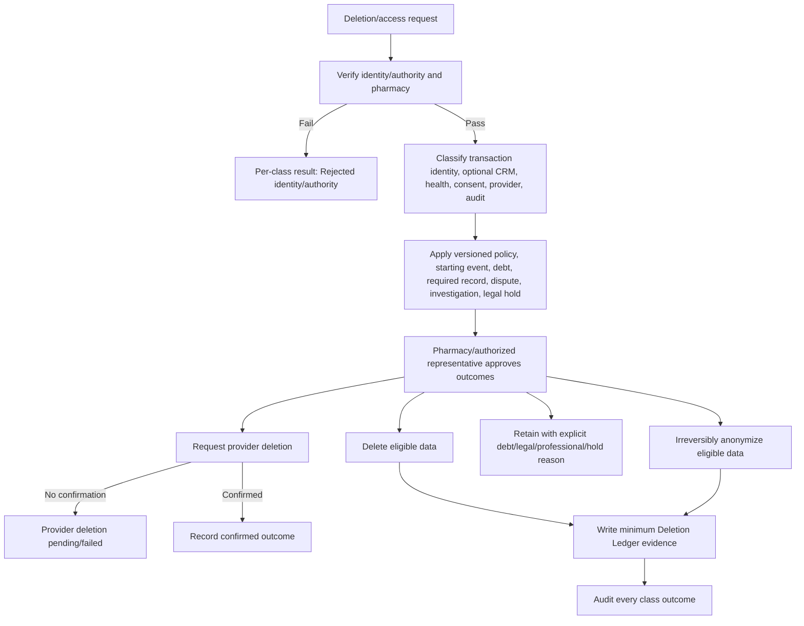
```mermaid
flowchart TD
  Request[Deletion/access request] --> Verify[Verify identity/authority and pharmacy]
  Verify -->|Fail| Reject[Per-class result: Rejected identity/authority]
  Verify -->|Pass| Classes[Classify transaction identity, optional CRM, health, consent, provider, audit]
  Classes --> Evaluate[Apply versioned policy, starting event, debt, required record, dispute, investigation, legal hold]
  Evaluate --> Decision[Pharmacy/authorized representative approves outcomes]
  Decision --> Delete[Delete eligible data]
  Decision --> Anon[Irreversibly anonymize eligible data]
  Decision --> Retain[Retain with explicit debt/legal/professional/hold reason]
  Decision --> Provider[Request provider deletion]
  Provider -->|No confirmation| Pending[Provider deletion pending/failed]
  Provider -->|Confirmed| Confirmed[Record confirmed outcome]
  Delete --> Ledger[Write minimum Deletion Ledger evidence]
  Anon --> Ledger
  Ledger --> Audit[Audit every class outcome]
```

Pseudonymized/linkable data is never called anonymous. Optional profile links may be detached without changing immutable posted business facts. A scoped Legal Hold pauses disposal only for its named records.

### Backup restoration after later privacy/security changes

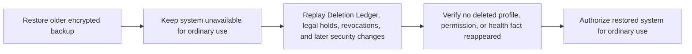
```mermaid
flowchart LR
  Restore[Restore older encrypted backup] --> Quarantine[Keep system unavailable for ordinary use]
  Quarantine --> Replay[Replay Deletion Ledger, legal holds, revocations, and later security changes]
  Replay --> Verify[Verify no deleted profile, permission, or health fact reappeared]
  Verify --> Release[Authorize restored system for ordinary use]
```

Backup archives expire naturally under the approved rolling 30-day policy; they are not individually rewritten.

### Cloud outage and recovery

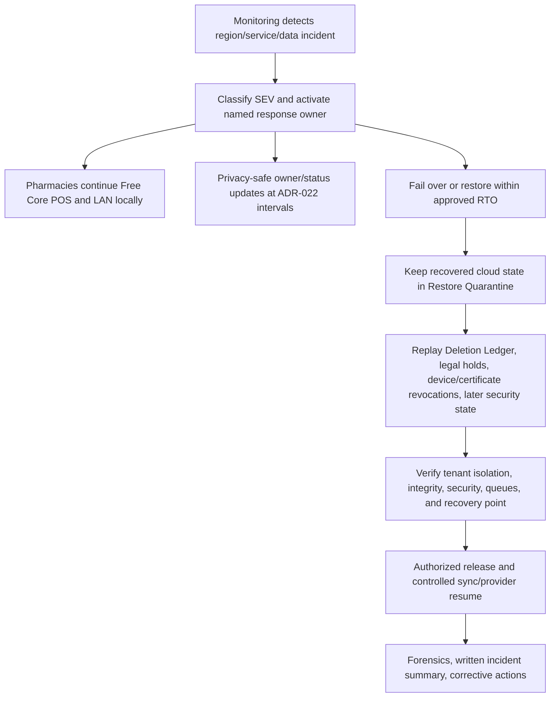
```mermaid
flowchart TD
  Detect[Monitoring detects region/service/data incident] --> Classify[Classify SEV and activate named response owner]
  Classify --> Local[Pharmacies continue Free Core POS and LAN locally]
  Classify --> Communicate[Privacy-safe owner/status updates at ADR-022 intervals]
  Classify --> Recover[Fail over or restore within approved RTO]
  Recover --> Quarantine[Keep recovered cloud state in Restore Quarantine]
  Quarantine --> Replay[Replay Deletion Ledger, legal holds, device/certificate revocations, later security state]
  Replay --> Verify[Verify tenant isolation, integrity, security, queues, and recovery point]
  Verify --> Release[Authorized release and controlled sync/provider resume]
  Release --> Review[Forensics, written incident summary, corrective actions]
```

The cloud RPO is at most 15 minutes and RTO at most 4 hours; monthly automated restore verification and quarterly full drills provide evidence. Cloud synchronization/backups never replace the pharmacy's independent local backup. A public status view reports affected capability/region without tenant or patient details.

### Patient export and support access

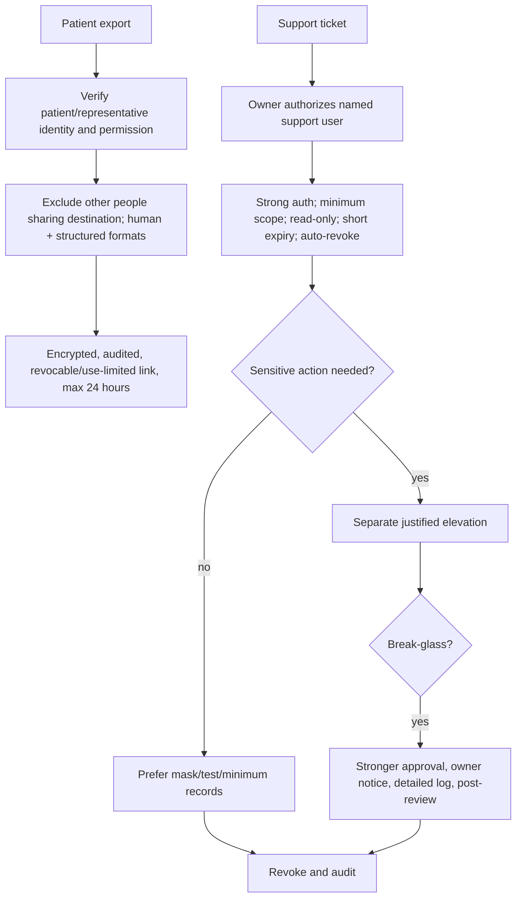
```mermaid
flowchart TD
  Export[Patient export] --> Identity[Verify patient/representative identity and permission]
  Identity --> Scope[Exclude other people sharing destination; human + structured formats]
  Scope --> Link[Encrypted, audited, revocable/use-limited link, max 24 hours]
  Ticket[Support ticket] --> Owner[Owner authorizes named support user]
  Owner --> Grant[Strong auth; minimum scope; read-only; short expiry; auto-revoke]
  Grant --> Need{Sensitive action needed?}
  Need -- no --> Redact[Prefer mask/test/minimum records]
  Need -- yes --> Elevate[Separate justified elevation]
  Elevate --> Emergency{Break-glass?}
  Emergency -- yes --> Glass[Stronger approval, owner notice, detailed log, post-review]
  Redact --> End[Revoke and audit]
  Glass --> End
```

Shared/standing support accounts are prohibited. Download, export, screenshot, direct-database access, and writes are separate elevated capabilities—not side effects of a support session.

## Patient message

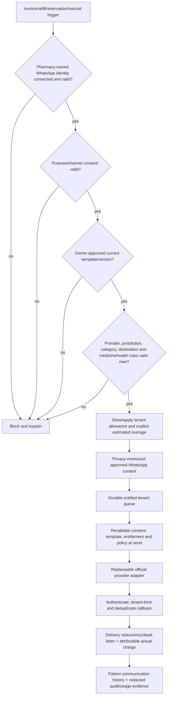
```mermaid
flowchart TD
  Trigger[Invoice/refill/reservation/manual trigger] --> Identity{Pharmacy-owned WhatsApp identity connected and valid?}
  Identity -- no --> Block[Block and explain]
  Identity -- yes --> Consent{Purpose/channel consent valid?}
  Consent -- no --> Block[Block and explain]
  Consent -- yes --> Template{Owner-approved current template/version?}
  Template -- no --> Block
  Template -- yes --> Gate{Provider, jurisdiction, category, destination and medicine/health rules valid now?}
  Gate -- no --> Block
  Gate -- yes --> Cost[Show/apply tenant allowance and explicit estimated overage]
  Cost --> Privacy[Privacy-minimized approved WhatsApp content]
  Privacy --> Queue[Durable entitled tenant queue]
  Queue --> Revalidate[Revalidate consent, template, entitlement and policy at send]
  Revalidate --> Provider[Replaceable official provider adapter]
  Provider --> Webhook[Authenticate, tenant-bind and deduplicate callback]
  Webhook --> Status[Delivery status/retry/dead-letter + attributable actual charge]
  Status --> Audit[Patient communication history + redacted audit/usage evidence]
```

Each pharmacy owns one or more explicitly approved dedicated business numbers; a sender is never shared across tenants. Breev's provider access is revocable and replaceable without changing ownership, subject to current platform migration rules. No in-memory timer is a scheduler. Withdrawal cancels unsent work and requests/records provider cancellation or deletion where possible. Consent for a shared patient phone never transfers between Patients. Telegram/SMS are outside the initial workflow; every medicine/health-related WhatsApp template in Iraq remains disabled until current Meta policy plus Iraqi legal and pharmacist gates pass.

### Local external link and outbound automation

```mermaid
flowchart TD
  Local[Open local read-only Patient/invoice link] --> Permission[Check role, purpose, tenant, and retention state]
  Permission --> View[Show approved local association; no mutation/export]
  Connector[Request paid connector] --> Contract[Load versioned Outbound Integration Contract]
  Contract --> Gate[Check entitlement, fields, purpose/basis, consent, provider/jurisdiction, region, destination]
  Gate -- fail --> Block[Block and explain]
  Gate -- pass --> Queue[Durable encrypted tenant-bound outbound job]
  Queue --> Revalidate[Revalidate all gates at send time]
  Revalidate -- fail --> Cancel[Cancel/hold and audit]
  Revalidate -- pass --> Send[Send minimum allow-listed fields]
  Send --> Callback[Authenticate/idempotent status callback]
  Callback --> Status[Record delivery/status only; never overwrite local facts]
```

The free local link is not an export. Patient/health fields remain blocked by default; every connector is paid, field-scoped, revocable, and separately reviewed.

### POS responsiveness and accessible interaction

```mermaid
flowchart LR
  Input[Barcode / keyboard / pointer / assistive technology] --> Focus[Preserve logical visible focus and AR/EN direction]
  Focus --> Feedback[Accessible validation/loading/offline/success/error status]
  Feedback --> Local[Execute local atomic operation without internet]
  Local --> Measure[Record percentile performance on certified profile]
  Measure --> Review[Release review: WCAG2.2 AA/WCAG2ICT + p95/p99 evidence]
```

Performance targets are measured from user input to meaningful local feedback, and printing is measured separately at spool handoff. A faster response never justifies skipping validation, permission, audit, safety, or transaction atomicity.

## One-way cloud sync

```mermaid
sequenceDiagram
  participant Domain as Local domain transaction
  participant Outbox as Local outbox
  participant Sync as Sync worker
  participant Cloud as Tenant-isolated cloud inbox/projection
  Domain->>Outbox: commit integration envelope atomically
  Sync->>Outbox: read after checkpoint
  Sync->>Cloud: send idempotency key + versioned payload
  Cloud->>Cloud: deduplicate, authorize entitlement, apply projection
  Cloud-->>Sync: durable acknowledgement/checkpoint
  Sync->>Outbox: record delivered checkpoint
```

Basic cloud views do not send edits back. Two-way workflows are intentionally undefined until Q-011 is approved.

For the future higher tier, cloud-to-local writes are never replication updates:

```mermaid
sequenceDiagram
  participant User as Cloud user
  participant Cloud as Cloud command service
  participant Local as Local API
  participant Module as Owning domain module
  User->>Cloud: Request approved field change
  Cloud->>Cloud: Assign command ID, expiry, expected version
  Cloud-->>User: Pending
  Cloud->>Local: Deliver/retry idempotent command when online
  Local->>Local: Validate identity, permission, entitlement, tenant/device, field, version
  Local->>Module: Execute validated domain command
  Module-->>Local: Applied or business rejection/conflict
  Local-->>Cloud: Signed/authorized acknowledgement + reason
  Cloud-->>User: Applied / Rejected / Conflict / Expired / Cancelled
```

Posted transaction, inventory, payment/Cash Box, and journal records remain view-only in cloud. Only fields in a versioned ownership matrix may receive commands; cloud-authoritative plans/licences/provider metadata cannot be elevated locally. Price changes are future-only and referenced records use archive/deactivation rather than direct deletion. Existing-draft repricing remains Q-011C.

### Higher-tier sync conflict resolution

```mermaid
sequenceDiagram
  participant Cloud
  participant Local as Local API
  participant Resolver as Owner / trusted resolver
  Cloud->>Local: Command with base version/value
  Local->>Local: Compare newest record version
  Local-->>Cloud: Conflict + conflict ID
  Resolver->>Local: Review Base / Current Local / Requested Cloud
  Resolver->>Local: Keep Local / Apply Requested / merge approved independent fields
  Local->>Local: Revalidate newest version, permission, entitlement, rules
  Local-->>Cloud: Applied or remains Conflict/Rejected
```

Competing values for one atomic field are never auto-merged. A resolution is a new local validation, not an overwrite of the stale command. Conflict and command IDs make detection and resolution idempotent; the complete audit remains available even if the unresolved command later expires.

## Paid expiry and Free Core fallback

```mermaid
flowchart TD
  Licence[Validate signed tenant/device licence with trusted time] --> State{Entitlement state}
  State -- active --> Paid[Paid features available]
  State -- expired, days 1-7 inclusive --> Grace[Existing paid features continue]
  Grace --> Warn[Owner/admin warning: expiry, grace end, renewal]
  State -- tamper suspected --> Protect[Stop paid extension; preserve Free Core/data]
  State -- day 8 at 00:00 --> Free[Main PC Free Core fallback]
  Free --> Keep[Core sales + data/history/report/print/backup/export/renewal]
  Free --> Stop[No new additional-terminal/provider/cloud paid work]
  Stop --> Queued[Preserve drafts/jobs with explicit expired status]
  Licence --> Reconnect[Internet reconciliation]
  Reconnect --> Renewed{Server entitlement active?}
  Renewed -- yes --> Restore[Restore paid features without reinstall/data recovery]
  Renewed -- no --> Free
```

- Grace end is inclusive. Example: expiry August 31; grace runs through September 7; fallback begins September 8 at 00:00 Trusted Breev Time.
- Signed licence contains tenant/pharmacy, licensed device, plan/features, expiry, grace end, issue time, version, and signature.
- Windows restart, time-zone/clock rollback, or remaining offline cannot extend paid access. Cashiers do not receive repetitive disruptive warnings.
- Paid-only output/config remains viewable where safe. Jobs are not silently discarded. Drafts complete from main PC if core-compatible, otherwise remain preserved/read-only or explicitly converted.
- Expiry, grace, tamper, fallback, reconciliation, renewal, and restoration are audited. Data is never deleted/hidden/encrypted or made subscription-dependent for backup/export/supported restore.

## Recovery and support workflow details still to design

- Local database backup, restore, corruption/health check, and installer repair.
- Lost/retired main computer and safe replacement.
- Diagnose and repair discovery/TLS failures without bypassing ADR-015 trust.
- Subscription expiry/grace/tamper with continuing data access.
- Failed/partial provider jobs and dead-letter reprocessing.
- Sync backlog/conflict visibility and audited support access.
- Cloud provider/region failover, restore-quarantine release, incident communications, and recovery-drill evidence under ADR-022.
- Signed update discovery/download, owner deferral, maintenance-window drain, migration failure, binary rollback versus database recovery, repair, and incompatible-terminal handling under ADR-024.

### Signed update and migration

```mermaid
flowchart TD
  Feed[Signed manifest available] --> Verify[Verify signer, chain, hash, target, compatibility, deadline]
  Verify -->|fail| Reject[Reject and audit; keep current release]
  Verify -->|pass| Notify[Notify owner/admin; download signed package]
  Notify --> Window{Safe maintenance window?}
  Window -- no --> Defer[Bounded deferral; continue Core POS]
  Window -- yes --> Drain[Drain active transactions, payments, jobs, backups, terminals]
  Drain --> Backup[Create and verify encrypted pre-update recovery point]
  Backup --> Install[Install signed binaries]
  Install --> Migrate[Run forward-only resumable migration]
  Migrate --> Health{Health, integrity, permission, compatibility checks pass?}
  Health -- yes --> Resume[Reopen and audit final version]
  Health -- no --> Recover[Binary rollback only if schema-compatible; otherwise restore pre-update point before release]
  Recover --> Repair[Audit repair/recovery result; reconcile if older point is used]
```

A critical deadline may isolate only the affected unsafe LAN/cloud/paid capability; it must not make the main-computer Free Core POS, data, backup, export, or renewal unavailable. After a released transaction exists, forward repair is preferred to restoring an older database.

### High-risk action authorization

```mermaid
flowchart TD
  Request[User requests sensitive action] --> Permission{Named permission and entitlement?}
  Permission -- no --> Reject[Reject and audit]
  Permission -- yes --> Risk{Step-up or dual control?}
  Risk -- step-up --> Reauth[Re-authenticate same user]
  Risk -- dual --> Prepare[Create expiring request with reason/evidence]
  Prepare --> Different{Different authorized approver?}
  Different -- no --> Pending[Remain pending; no self-approval]
  Different -- yes --> Approve[Approver reviews and authenticates]
  Reauth --> Fresh[Revalidate newest record/version, rules, period, stock, entitlement]
  Approve --> Fresh
  Fresh -- fail/stale --> Expire[Reject or expire; recreate request]
  Fresh -- pass --> Post[Execute atomically and audit actors/device/time/outcome]
```

Ordinary sales remain fast. High-risk actions such as manual journals, bulk health exports, privilege grants, and selected corrections use dual control; no generic emergency bypass exists.
